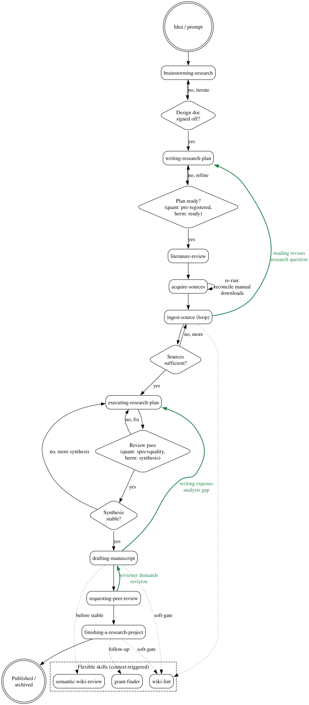

# Phase Flow

The research workflow as a directed graph. Boxes = phases (skills). Diamonds = SOFT-GATEs. Back-edges (green) = legitimate iteration, not failure.



Source: [`assets/phase-flow.dot`](assets/phase-flow.dot) is the single source of truth. The SVG is regenerated by `dot -Tsvg docs/assets/phase-flow.dot -o docs/assets/phase-flow.svg` (requires [Graphviz](https://graphviz.org)).

## Notes

- **Forward edges** are the idealised path. They are neither mandatory nor sufficient — they structure what is often sensible.
- **Back-edges (green)** are legitimate hermeneutic iteration:
  - `ingest-source → writing-research-plan` — new reading revises the research question. Constitutive of the hermeneutic circle.
  - `drafting-manuscript → executing-research-plan` — writing exposes an analysis gap.
  - `requesting-peer-review → drafting-manuscript` — a reviewer finding requires revision.
- **Pre-registration** applies only when `methodology: quantitative` (fully) or `mixed` (for marked sub-studies). For `methodology: hermeneutic`, `status: ready` is enough — no frozen hypothesis. Deviations on quantitative tasks go into `knowledge/_meta/log.qmd`; downstream results are flagged `status: exploratory`.
- **Sources threshold** (~15 A/B sources for a chapter) is a rule of thumb, not magic. SOFT-GATE override with a justification is fine.
- **Reviews** in `executing-research-plan` are methodology-aware: two-stage (spec + quality) for quantitative tasks, synthesis review for hermeneutic.
- **Dotted edges** are advisory invocations, not mandatory transitions.
- **`critical-thinking`** is no longer a standalone skill (since v0.2). Its content lives as a cross-cutting checklist in `executing-research-plan` (method selection) and `requesting-peer-review` (evidence audit).

## Rendering

The SVG embedded above is the canonical visualisation. To regenerate after editing the `.dot` source:

```bash
dot -Tsvg docs/assets/phase-flow.dot -o docs/assets/phase-flow.svg
```

For a PNG (useful for slide decks or PDF exports):

```bash
dot -Tpng -Gdpi=144 docs/assets/phase-flow.dot -o docs/assets/phase-flow.png
```
