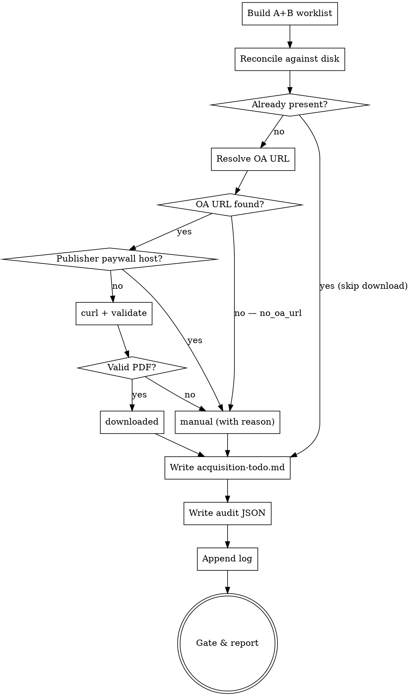

## Boundary: literature-review → acquire-sources → ingest-source

`literature-review` runs SEARCH — it builds the graded guide and BibTeX. **It downloads nothing.**

`acquire-sources` runs ACQUISITION — it turns the A+B graded guide into PDF files on disk, and for everything it cannot fetch automatically it writes a **manual-download worklist** (`acquisition-todo.md`). **This skill owns all downloading.**

`ingest-source` runs INTAKE — it reads an already-acquired original. It does **not** download, and it **hard-stops** rather than silently substituting a preprint/review for a missing original.

Sequence: literature-review once → **acquire-sources once (re-run to reconcile)** → ingest-source N times.

# Acquire Sources (OA auto-download + manual worklist)

Get the actual PDFs onto disk before ingest. Two outcomes per source: either an Open-Access copy is fetched automatically into `input/bibliography/`, or the source goes onto a worklist the user clears manually (university VPN / library proxy reach far more originals than a bot can — publishers block automated downloads). The manual worklist is a **first-class output, not a failure**: it is the bridge that lets the human do what the agent cannot.

**Announce at start:** "Using acquire-sources to obtain the A+B PDFs and build a manual-download worklist for the rest."

<SOFT-GATE>
Before closing acquisition, check:
(1) every A+B source in `literaturguide.md` is in exactly one bucket: `downloaded` | `already-present` | `manual` | `skipped`,
(2) every `downloaded`/`already-present` file exists in `input/bibliography/` under its `Lastname - Title - Year.pdf` name AND passed PDF validation (not an HTML page),
(3) `input/bibliography/acquisition-todo.md` lists every `manual` item (or states "none — all sources acquired"),
(4) `input/bibliography/acquisition-log-<date>.json` is written,
(5) `knowledge/_meta/log.md` has a new `acquire` entry.

Report counts: "Acquired N of M A+B sources. K need manual download — see `acquisition-todo.md`, fetch via VPN into `input/bibliography/` under the exact filenames, then re-run acquire-sources (or proceed to ingest the present ones)." If a condition is unmet: name it, ask for a one-line reason, write it to `knowledge/_meta/gate-overrides.log`, and close.
</SOFT-GATE>

## When to use

- `literature-review` has produced a `literaturguide.md` and you want the PDFs before ingest
- You manually downloaded some originals via VPN and want to reconcile the worklist (re-run)
- A draft or ingest run reported a missing original and you need to acquire it

**NOT for:** searching (use `literature-review`), reading a source into the wiki (use `ingest-source`), or downloading a single ad-hoc URL.

## Checklist

Create TodoWrite tasks for each:

1. **Build the A+B worklist** — read `literaturguide_path` and `bibtex_path`. For every source graded in `grade_scope` (default `A,B`), collect: `bibkey`, authors, year, short title, grade, `doi`, `url`, `oa_pdf` (the per-candidate fields the `literature-scout` agent emits), and the target filename `Lastname - Title - Year.pdf` (first author's surname; sanitise the title — strip `/ : * ? " < > |`, collapse whitespace, keep it short).
2. **Reconcile against disk first (idempotent)** — scan `input/bibliography/*.pdf`. Match each worklist item by exact target filename, then fuzzily by `Lastname` + `Year`. A match → `already-present`; **never re-download it.**
3. **Resolve a download URL** for each still-missing item, in priority order:
   (a) `oa_pdf` carried in the guide / scout output;
   (b) `dao-paper-search-mcp` by DOI — `search_crossref` / `search_openalex` / `search_core` / `search_zenodo` / `search_arxiv` → `oa_pdf` (OpenAlex: `best_oa_location.pdf_url`);
   (c) Unpaywall by DOI (`https://api.unpaywall.org/v2/<doi>?email=<contact>` → `best_oa_location.url_for_pdf`);
   (d) none found → `manual` with reason `no_oa_url`.
4. **Attempt the download (curl, validated — see below)** → `downloaded` or `manual` (with reason).
5. **Regenerate `acquisition-todo.md`** — only the `manual` items, with the instruction header. Resolved items drop out automatically on each run.
6. **Write `acquisition-log-<date>.json`** — the audit (see below).
7. **Append to `knowledge/_meta/log.md`** — one `acquire` entry.
8. **Gate & report** per the SOFT-GATE.

## Download mechanism — concrete and validated (the core)

> **WebFetch / `fetch_url` return extracted markdown, not a binary file** — they cannot save a PDF. The real download is **Bash `curl`** into a temp file, followed by **validation**. The #1 failure mode is a saved HTML "Access Denied" / login / Cloudflare page that *looks* like a successful 200 — it must NEVER be mistaken for a PDF.

```bash
URL="…"
TARGET="input/bibliography/Lastname - Title - Year.pdf"
TMP="$(mktemp -t acq).pdf"
# Capture curl's OWN exit status (network errors → curl_error). The -w format
# ends in \n so the later `read` gets a terminated line and does not falsely
# report failure.
META=$(curl -sS -L \
  -A "Mozilla/5.0 (research-superpowers acquire-sources; mailto:<contact>)" \
  --max-time 90 --retry 2 \
  -w '%{http_code} %{content_type}\n' \
  -o "$TMP" "$URL") || { rm -f "$TMP"; echo "manual:curl_error"; }
read -r CODE CTYPE <<< "$META"   # e.g. CODE=200  CTYPE=application/pdf
```

Accept the file as `downloaded` only if **ALL** hold; otherwise classify `manual` and `rm "$TMP"`:

1. **HTTP 200** (`$CODE` == 200).
2. **Content-Type contains `application/pdf`** (`$CTYPE`, cross-checked with `file --mime-type "$TMP"`). `text/html` → paywall/login → `manual` (`not_pdf_content_type`).
3. **Magic bytes** — first 5 bytes are `%PDF-` (`head -c5 "$TMP"`). Catches HTML served with a wrong content-type.
4. **Non-trivial size** — `> ~10 KB` (`wc -c < "$TMP"`). A 2 KB "file" is an error page (`too_small`).
5. **Not an HTML error/login page** — reject if the head starts with `<!DOC` / `<html` / `{`, or contains a `<title>` with "Access Denied" / "Just a moment" (Cloudflare) / "Sign in" / "Captcha" (`html_login_page` / `cloudflare_block`).

On success: `mv "$TMP" "$TARGET"`, classify `downloaded`. Record the failure reason on every `manual`: `http_4xx | not_pdf_content_type | html_login_page | cloudflare_block | too_small | no_oa_url | curl_error`.

**Source-class routing** (decide *before* burning a curl attempt):

| OA-friendly → attempt curl | Route straight to `manual` (do not attempt) |
|---|---|
| arXiv, Zenodo, CORE | Elsevier / Springer / Wiley / Taylor&Francis / SAGE paywalls |
| OpenAlex `best_oa_location.pdf_url` | JSTOR; De Gruyter / Brill (usually paywalled) |
| Institutional repositories / DOAJ / OAPEN | Anything behind Cloudflare ("Just a moment") |
| Unpaywall-resolved `url_for_pdf` | Publisher landing pages with no OA PDF; Google Books |

The validation step is the real safety net: an over-optimistic attempt that returns HTML is still caught and downgraded to `manual`.

**MCP soft-preference (recommended).** If `dao-paper-search-mcp` (see [`docs/recommended-mcps.md`](../../docs/recommended-mcps.md)) is available, resolve OA links via its `oa_pdf` field and feed `audit.source_class` into routing — `aggregator` / `suspect` → `manual`, never auto-download. Otherwise use the guide's `oa_pdf`, then Unpaywall.

## `acquisition-todo.md` — the manual-download worklist

Regenerated on every run (resolved items disappear). Layout:

```markdown
# Source acquisition — manual downloads needed

These A+B sources could not be auto-downloaded (paywalled, bot-blocked, or no
Open-Access copy). Download each **original** PDF via your university VPN /
library proxy, save it into `input/bibliography/` under the **exact** "Save as"
filename below, then **re-run acquire-sources** to reconcile (resolved rows
disappear) — or run `ingest-source` on the ones already present.

Do NOT substitute a preprint, prior version, or book review for the original —
`ingest-source` hard-stops on a missing original.

Last updated: <YYYY-MM-DD> · <K> of <M> A+B sources still needed.

| ☐ | Citekey | Author Year | Short title | Grade | DOI / landing | Best download URL(s) | Save as (exact filename) |
|---|---------|-------------|-------------|-------|---------------|----------------------|--------------------------|
| [ ] | finkelstein-2003 | Finkelstein 2003 | Low Chronology Revisited | A | [10.1179/…](https://doi.org/10.1179/…) | <links or "—"> | `Finkelstein - The Low Chronology and the Problem of Iron Age Palestine - 2003.pdf` |
```

The `Citekey` and `Save as` columns are load-bearing: they tie the manually-downloaded file to its BibTeX key and to the filename `ingest-source` expects. `DOI / landing` gives the canonical resolver; `Best download URL(s)` lists any concrete-but-unfetchable PDF candidate worth a browser try.

## `acquisition-log-<date>.json` — the audit (date-stamped, never clobbered)

Mirrors the `audit-log-<date>.json` convention of `literature-review`:

```json
{
  "skill": "acquire-sources",
  "date": "2026-06-23",
  "literaturguide": "input/bibliography/literaturguide.md",
  "grade_scope": ["A", "B"],
  "totals": { "worklist": 18, "downloaded": 9, "already_present": 2, "manual": 6, "skipped": 1 },
  "items": [
    {
      "bibkey": "finkelstein-2003", "grade": "A", "doi": "10.1179/…",
      "resolved_url": "https://…", "url_source": "unpaywall|oa_pdf|crossref|openalex|core|none",
      "outcome": "downloaded|already-present|manual|skipped",
      "reason": "html_login_page|not_pdf_content_type|cloudflare_block|too_small|no_oa_url|null",
      "saved_as": "Finkelstein - … - 2003.pdf",
      "validated": { "http": 200, "content_type": "application/pdf", "magic_pdf": true, "bytes": 842113 }
    }
  ]
}
```

## Log entry

Append to `knowledge/_meta/log.md` (the heading-prefixed form used by ingest/lint):

```markdown
## [2026-06-23] acquire | A+B sources
- Downloaded 9, already present 2, manual 6, skipped 1 (of 18 A+B)
- Manual worklist: [[acquisition-todo]] (6 items)
- Audit: input/bibliography/acquisition-log-2026-06-23.json
```

## Reconcile / re-run mode (idempotent — the loop)

Re-running is safe and is the intended loop:

- Step 2 rescans `input/bibliography/*.pdf`. Any item now present (the user fetched it via VPN, or a flaky OA link now works) → `already-present`, **removed** from the regenerated `acquisition-todo.md`.
- Still-missing items stay; their URLs are re-resolved (an OA copy may have appeared since).
- `downloaded` / `already-present` files are **never** re-fetched.
- The audit JSON is written fresh per run; its date-stamped filename means no clobber.
- Report the delta: "Since last run: 4 manual items now present, 2 still missing." The loop is: download some → re-run → ingest the present ones.

## Process Flow



## Subagent Dispatch (recommended for large sets)

For a worklist of ≥ ~8 items, dispatch the `source-acquirer` subagent (see `agents/source-acquirer.md`). Downloads are **noisy** — curl progress, validation failures, HTML dumps from blocked pages — exactly the context pollution a subagent isolates (the same rationale `literature-scout` uses for search noise and `source-ingester` for per-PDF reading). The subagent runs the resolve+curl+validate batch (steps 3–4) and returns a **compact status table**; the parent never sees the raw chatter. The decisions — `grade_scope`, confirming the manual list, the gate report — stay in the main conversation. Small sets run inline.

## Red Flags

| Thought | Reality |
|---------|---------|
| "WebFetch gave me the PDF text, so it's downloaded" | No — WebFetch returns markdown, not a file. Only a validated `curl` save counts. |
| "curl returned 200, so it's a PDF" | 200 + an HTML login page is the commonest failure. Check content-type AND `%PDF-` magic bytes AND size. |
| "The preprint is basically the same — I'll save it as the original" | No — wrong pagination, possibly different claims. The original goes on the manual worklist; substitution is `ingest-source`'s consent-gated decision, not yours. |
| "The A-grade ones are paywalled, I'll skip them" | A-grade is must-read. Paywalled ≠ skip — it goes on the manual worklist for the user's VPN. |
| "URLs in the guide are enough" | Link rot is real. The whole point of this phase is files on disk before ingest. |
| "I'll just re-download everything each run" | No — reconcile against disk first; `already-present` files are never re-fetched. |
| "An empty acquisition-todo.md means I failed" | The opposite — empty means every A+B source is on disk. The worklist is a tool, not a defect. |

## Key Principles

- **Files on disk before ingest** — the manual worklist is a first-class output, not a failure.
- **Validate every download** — content-type + magic bytes + size + not-HTML. A saved error page is never a source.
- **Idempotent** — reconcile against disk first; re-run any number of times.
- **Exact filenames tie manual downloads to ingest** — `Lastname - Title - Year.pdf`, the convention `ingest-source` looks for.
- **OA-first, paywall-routed** — attempt the open repositories, route publisher paywalls straight to the human.
- **Transparency** — the audit JSON records every resolution and every failure reason.
