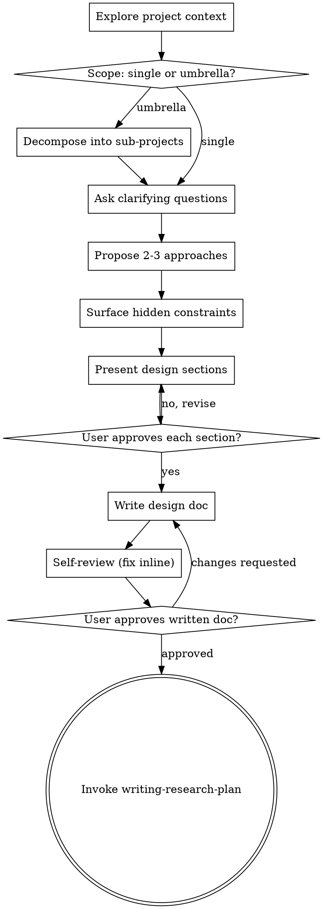

# Brainstorming Research Ideas Into Designs

Turn a vague research interest into a written, approvable design doc. Act as an ideation partner, not an instructor. Probe, challenge, surface unexamined assumptions — then lock the design down on paper so later phases have something stable to build on.

<SOFT-GATE>
Before transitioning to `writing-research-plan`, `literature-review`,
`ingest-source`, `executing-research-plan`, `drafting-manuscript`, or any
analysis skill, check:
(1) A design document has been written to `input/ideas/<slug>-design.md`
(2) The user has approved it

If unmet: explain to the user what's missing, ask for a short reason for
skipping (e.g. "mini-review, not a standalone project"), write it to
`knowledge/_meta/gate-overrides.log`, and continue. Repeated skipping is a
signal that the routine is fraying — the lint stats make that visible.
</SOFT-GATE>

## Anti-Pattern: "This Is Too Simple To Need A Design"

Every research project goes through this process. A single-source review, a short methodological note, a conference abstract — all of them. "Simple" projects are where unexamined assumptions cause the most wasted work. The design can be short (a half page for truly simple projects), but you MUST present it and get approval.

## Checklist

Create a TodoWrite task for each item. Complete in order:

1. **Explore project context** — read existing `input/ideas/*`, `input/description/*`, recent `knowledge/_meta/log.qmd`, check git for parallel work
2. **Ask clarifying questions — one at a time** — what is the research question, what has been seen already, what would success look like
3. **Assess scope** — is this a single focused inquiry or an umbrella of independent sub-projects? If the latter, decompose first (each sub-project gets its own design doc)
4. **Propose 2–3 approaches** — with trade-offs and your recommendation, grounded in disciplinary norms
5. **Surface hidden constraints** — ethics (ancient human remains, epigraphic access permissions), data rights, linguistic reach, time horizon, collaborator availability
6. **Present design in sections** — get user approval after each: question, state of the field (short), method, data, output target, risks
7. **Write design doc** — save to `input/ideas/<slug>-design.md` using the template below
8. **Design self-review** — scan for placeholders, contradictions, scope creep, ambiguous claims; fix inline
9. **User reviews the written doc** — ask for sign-off on the file before handing off
10. **Transition to writing-research-plan** — once approved, invoke that skill. Do NOT invoke anything else.

## Process Flow



**Terminal state:** invoke `writing-research-plan`. Do NOT invoke literature-review, ingest-source, or any execution skill directly — those belong after the plan is written.

## Design Doc Template

Save to `input/ideas/<slug>-design.md` (slug = short, kebab-case, e.g. `chronologie-levante-eisen-ii`).

```markdown
---
title: "<Research question in one sentence>"
type: design
created: YYYY-MM-DD
updated: YYYY-MM-DD
tags: [<field>, <region>, <method>]
status: draft
author: mixed
---

# <Title>

## Research Question
A precise, falsifiable or argumentatively testable guiding question.

## Relevance / Forschungsstand (brief)
2–5 sentences: why now, where the debate stands, which gap is addressed.
(Full literature work happens in literature-review — only positioning here.)

## Method
Which approach (*Quellenkritik*, stratigraphic comparison, quantitative
analysis, discourse-analytic reading …). Why this one and not the alternatives.

## Data Sources / Material Basis
Concrete archives, databases, text corpora, excavation publications, datasets.

## Output Target
☐ Book chapter   ☐ Journal article   ☐ Grant proposal   ☐ Talk   ☐ Other

## Expected Results
What would a meaningful positive result look like? What a null finding?

## Ethical / Methodological Risks
e.g. access rights to sources, handling of human remains, postcolonial
sensitivity, bias in transmission traditions.

## Feasibility
Time frame, tools (see CLAUDE.md §5), need for collaborators.

## Scope Boundaries (what is NOT investigated)
Explicit mention of related questions that fall out of scope.

## Next Step
Hand off to writing-research-plan to produce `input/ideas/<slug>-plan.md`.
```

## The Process

**Phase 1 — Understanding the idea:**
- Read recent project activity first (existing design docs, log, commits)
- Ask one question per message. Prefer multiple-choice where possible
- Focus: what is the question, what has already been looked at, what would success look like?

**Phase 2 — Divergent exploration** (carried over from scientific-brainstorming):
- Cross-domain analogies (e.g. transferring trade-network analysis from economic history to Iron Age ceramic distribution)
- Assumption reversal ("What if the chronology is the other way around?")
- Scale shifting (single find → site → region → macro-area)
- Interdisciplinary fusion (archaeology + epigraphy + palaeogenetics)

**Phase 3 — Critical evaluation:**
- What would it take to test this? What's the smallest meaningful sub-experiment?
- Which existing data can be exploited instead of collecting new data?
- Who else would need to be involved (institutions, collaborators)?

**Phase 4 — Write, self-review, hand off:**
- Write the design doc, run self-review, get sign-off
- Then — and only then — invoke `writing-research-plan`

## Self-Review Checklist (inline)

After writing the document, look at it with fresh eyes:

1. **Placeholder scan:** "TBD", "to be clarified", "relevant literature" without specifics — replace or delete
2. **Scope check:** Does this fit into ONE research plan, or is it begging to be decomposed?
3. **Falsifiability:** Could the question in principle also be answered in the negative? If not: rephrase
4. **Ambiguity:** Could "*Quellenkritik*" mean two different methods here? Make it explicit
5. **Scope boundary:** Is there ONE explicit line "not investigated: …"? If not, add one

Fix errors inline, no second review pass.

## User Review Gate

After self-review:

> "Design doc written and saved to `<path>`. Please look it over — if changes are needed, give them now. Once you green-light it, we move to writing-research-plan."

Wait for the reply. Only invoke `writing-research-plan` after approval.

## Key Principles

- **One question per message** — don't overload
- **Multiple choice preferred** — easier to answer
- **YAGNI** — cut unneeded sub-questions
- **Explore alternatives** — always offer 2–3 approaches
- **Incremental validation** — get sign-off section by section
- **Stay flexible** — go back when something is off
