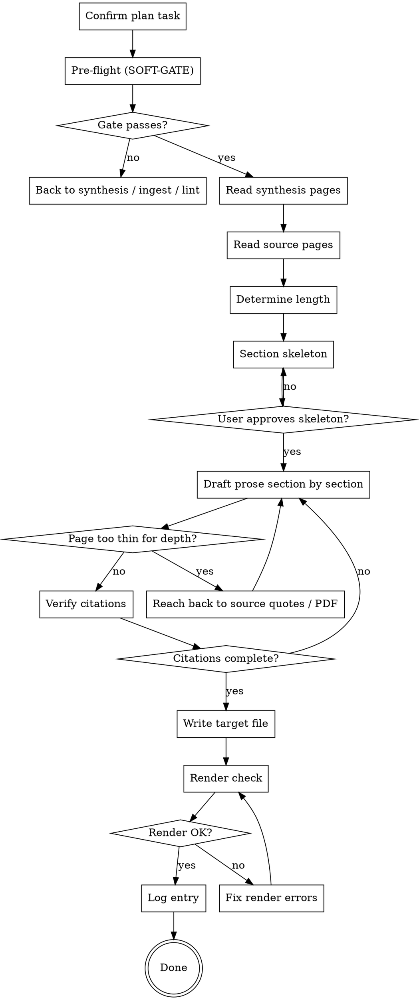

# Drafting a Manuscript

Turn stable synthesis pages into publishable prose. Every claim gets a citation. Every citation resolves in `output/bibtex/references.bib`. No inventing, no paraphrasing from memory — the wiki is the single source of truth for *what is claimed*.

But the wiki is deliberately terse — bullets, one-sentence claims, page numbers in parentheses. It is a **pointer to the depth, not the depth itself.** Drafting straight from it produces dense, compressed prose that reads like reflowed bullet points, without the examples and explanations a reader needs. The fix is *not* to write more from memory (that reintroduces hallucination) but to **reach back to the sources for depth**: the illustrative examples, the explanation of *why* a claim holds, and the surrounding argument live in the source pages' quote/example sections and — when those are too thin — in the original PDFs in the shared library (`<library>/pdf/<bibkey>.pdf`, put there by `acquire-sources`). Elaboration must be **grounded and cited**; only connective/expository framing (transitions, restating an argument's logic) is uncited. See [Writing with depth](#writing-with-depth-not-bullet-reflow) below.

**Announce at start:** "Using drafting-manuscript to draft <chapter/section> into `<path>`."

<SOFT-GATE>
Before drafting, check:
(1) At least one `knowledge/synthesis/*.md` with `status: stable` exists AND is referenced by the draft task
(2) Every source cited in the target section exists as `knowledge/sources/*.md` AND has a BibTeX entry
(3) `wiki-lint` is green on the knowledge tree
(4) The research plan `<slug>-plan.md` contains an explicit Draft task for this output file
(5) None of the synthesis / source pages this draft pulls from carries an open `review_flags` entry (`state: open`)

If a condition is unmet: tell the user which (e.g. "no stable synthesis yet"),
ask for a short reason to draft anyway, write it into
`knowledge/_meta/gate-overrides.log`, and start the draft. Repeated overrides
on (3) are a maintenance signal.

On (5): an open flag means a content review found an unresolved concern
(overstatement, weak support, stale claim) on a page you are about to turn into
prose — drafting from it would bake the problem into the manuscript. Prefer
resolving it first (fix the page, set the flag `state: resolved`) over
overriding. Note which page and flag `kind` in the override reason.
</SOFT-GATE>

## When to use

- A plan Draft task is current (`executing-research-plan` routes here)
- Synthesis page(s) are stable and user asks for chapter/article draft
- Rewriting a chapter after peer-review revisions (iterate via same skill)

**NOT for:** first-draft brainstorming (use `brainstorming-research`), unsynthesized material (go back and synthesize first), grant research narratives from scratch (use `grant-finder`).

## Checklist

1. **Confirm plan task** — find the exact entry in `<slug>-plan.md`; confirm output file path
2. **Pre-flight checks (SOFT-GATE)** — stable synthesis pages? BibTeX complete? wiki-lint green? No open `review_flags` on the pages you pull from?
3. **Read all referenced synthesis pages** fully
4. **Read all cited source pages** — the full page, especially the `### Direct quotes` and `### Examples & illustrations` sections (the raw material for depth), not just the one-line claims
5. **Determine target length** from the plan (words / pages / chapter size) — treat it as a floor for *development*, not a ceiling to pad toward
6. **Produce a section skeleton** — introduction, main parts, conclusion; confirm with user before prose
7. **Draft prose with depth** — one section at a time; develop each substantive point (assertion → grounding → example → significance, see [Writing with depth](#writing-with-depth-not-bullet-reflow)); citations inline as `[@bibkey]` or `[@bibkey, p. 152]`
8. **Reach back to sources where the wiki is thin** — when a page cannot support the needed elaboration, open its `### Direct quotes` / `### Examples & illustrations`; if still insufficient, open the original PDF at `<library>/pdf/<bibkey>.pdf` at the page anchors the source page cites, draw out the example/explanation, and cite it. Never fill the gap from memory.
9. **Verify every citation** — each `[@bibkey]` has a matching entry in `output/bibtex/references.bib`
10. **Write to target file** — `output/book/text/<nn-slug>.qmd` or `output/article/main.qmd`
11. **Render check** — run `make render` (or `quarto render`) in the target `output/<book|article>/` directory; fix any errors
12. **Log** — entry in `knowledge/_meta/log.md`: date, draft, target file, word count, source count

## Process Flow

## Citation Rules

- Inline citations: `[@finkelstein-2003]` or `[@finkelstein-2003, p. 152]`
- Multiple: `[@finkelstein-2003; @mazar-2011]`
- Every citation key MUST exist in `output/bibtex/references.bib`
- Direct quotes: inline with `>` or an em-dash, always with page number
- No uncited claims in argumentative sections (exception: common knowledge, clearly marked)
- **Web citations** (online databases, digital editions, research blogs without a BibTeX entry): use the `(domain — title)` form as an inline link, e.g. `[(idai.gazetteer.de — Tel Megiddo)](https://gazetteer.dainst.org/place/2048473)`. Use sparingly; group separately as "Web resources" in the references list.

## Writing with depth (not bullet-reflow)

The single most common failure of wiki-driven drafting is **bullet-reflow**: each terse wiki claim becomes one flat sentence, so the prose is dense, assertion-stacked, and unreadable. Avoid it by developing every substantive point instead of merely restating it.

**Three kinds of expansion — know which you are doing:**

| Expansion | Allowed? | Rule |
|-----------|----------|------|
| **Grounded elaboration** — examples, the explanation of *why* a claim holds, the argument around it | **Yes, do this** | Must come from the source (its page/quotes/examples or the PDF), and must be cited |
| **Expository framing** — transitions, restating an argument's logic, signposting | Yes | Rhetoric, not a new claim; uncited |
| **New factual claim from memory** | **No** | This is invention — the thing the wiki-only rule forbids |

**Develop each substantive point** — a useful pattern per paragraph (not a rigid template):

1. **Assertion** — the claim, in your own prose (from the wiki).
2. **Grounding** — the evidence or reasoning the source gives for it, cited `[@bibkey, p. XX]`.
3. **Example / illustration** — a concrete case the source uses (a specific artefact, site, dataset, passage). This is what the wiki bullet omits and what the reader needs — reach into the source for it.
4. **Significance** — why it matters for the section's argument (expository, uncited).

A single terse wiki bullet typically becomes a **developed passage**, not a single sentence. If a paragraph has assertions but no example and no explanation, it is not finished.

**Reach-back procedure** (checklist step 8) — escalate only as far as needed:

1. The source page's `### Direct quotes` and `### Examples & illustrations` sections — the cheapest, already-extracted depth.
2. If still too thin: open the **original PDF** at `<library>/pdf/<bibkey>.pdf` at the page numbers the source page cites (the anchors point you straight to the passage — no full re-read), and draw out the example/explanation.
3. Cite whatever you use. If the source genuinely lacks the needed depth, say so plainly or narrow the claim — do **not** fill the gap from memory.

> **Per-project house style.** Density, example-richness, and target register are tunable per project in the root `CLAUDE.md` ("Manuscript style"). Read it before drafting; it overrides the defaults here.

## MCP Optimisation (recommended)

> If `dao-paper-search-mcp` and `dao-searxng-mcp` (see [`docs/recommended-mcps.md`](../../docs/recommended-mcps.md)) are available, verify citations through the MCPs instead of reconstructing them from memory. Otherwise, copy strictly from the source page's "Direct quotes" sections.

- **Book / article citations**: `dao-paper-search-mcp.search_crossref(doi=...)` returns `inline_citation.markdown` (a ready Author-Year link) and `authoritative_bibliography_line` (the full references-list line). Paste both verbatim instead of formatting Author-Year yourself.
- **Web citations**: `dao-searxng-mcp.fetch_url(url=...)` returns `source_class`. If `aggregator` or `suspect`, either find the primary source or name the aggregator status transparently in the text.

## Subagent Dispatch (optional, for long chapters)

For chapters > 3000 words, dispatch `drafter` subagent (see `agents/drafter.md`) per section. The subagent receives:
- The section outline
- List of synthesis pages (paths) to pull from
- List of source pages (paths) with allowed citation keys
- **List of the corresponding source PDF paths** (`<library>/pdf/<bibkey>.pdf` — resolve with `scripts/library.py`) — so the subagent can reach back for examples/context when a page is thin (checklist step 8). Without these, the subagent can only bullet-reflow.
- Target word count (a floor for development, not a ceiling to pad)

Main conversation composes the final draft from section outputs.

## Quarto Template Hooks

The template's `output/book/` uses a Quarto book structure (see `templates/research-project-template/output/book/`):

- `_quarto.yml` defines the chapter list — update when adding a new chapter file
- `text/<nn-slug>.qmd` is the chapter-file naming convention (`01-introduction.qmd`, `02-state-of-the-field.qmd`, …)
- `template/_preamble.tex` holds LaTeX preamble for PDF output
- `Makefile` targets: `make render`, `make preview`, `make clean`

For articles, use `output/article/main.qmd` with single-file layout.

## Red Flags

| Thought | Reality |
|---------|----------|
| "The source roughly says …" | Either a verbatim quote with page, or a paraphrase with a citation. No hearsay. |
| "I've turned every wiki bullet into a sentence — done" | That is bullet-reflow, not prose. Each substantive point needs development: grounding, an example from the source, and why it matters. |
| "The wiki page is thin, so the paragraph is thin" | The wiki points to the depth; the source holds it. Reach back to the quotes/examples or the PDF and cite — don't ship a thin paragraph. |
| "It needs more depth, I'll just add explanation I know" | Grounded elaboration comes from the source and is cited. Explanation from memory is invention. |
| "I'll cite this passage properly later" | Later citations get forgotten. Get it right now, or not at all. |
| "I'll start drafting; structure can come later" | Skeleton first, sign-off, then prose. |
| "Wiki-lint isn't needed, I know everything is fine" | Mandatory before every draft — broken wikilinks are invisible when rendered. |
| "This page is `stable`, so it's safe to draft" | Stable is maturity, not health. An open `review_flag` on it is an unresolved content concern — resolve or override, don't ignore. |
| "The chapter is so good, I'll ignore the render errors" | A chapter that won't render is not a chapter. |

## Key Principles

- **The wiki is truth** — every claim traceable to a synthesis or source page
- **Elaborate from the source, not from memory** — the wiki says *what* is claimed; the source holds the examples and explanations. Reach back and cite; a thin wiki page is a pointer, not a limit
- **Develop, don't reflow** — a wiki bullet becomes a developed passage (assertion → grounding → example → significance), not one flat sentence
- **Every citation verified** — bibkey existence before commit
- **Skeleton before prose** — structural sign-off first
- **Render check is part of drafting** — not "later"
- **One draft per run, one log entry** — keep changes traceable
