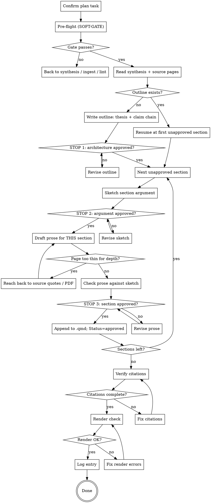

# Drafting a Manuscript

Turn stable synthesis pages into publishable prose. Every claim gets a citation. Every citation resolves in `output/bibtex/references.bib`. No inventing, no paraphrasing from memory — the wiki is the single source of truth for *what is claimed*.

But the wiki is deliberately terse — bullets, one-sentence claims, page numbers in parentheses. It is a **pointer to the depth, not the depth itself.** Drafting straight from it produces dense, compressed prose that reads like reflowed bullet points, without the examples and explanations a reader needs. The fix is *not* to write more from memory (that reintroduces hallucination) but to **reach back to the sources for depth**: the illustrative examples, the explanation of *why* a claim holds, and the surrounding argument live in the source pages' quote/example sections and — when those are too thin — in the original PDFs in the shared library (`<library>/pdf/<bibkey>.pdf`, put there by `acquire-sources`). Elaboration must be **grounded and cited**; only connective/expository framing (transitions, restating an argument's logic) is uncited. See [Writing with depth](#writing-with-depth-not-bullet-reflow).

And the wiki tells you *what is claimed* — never *what this chapter argues*. The claim chain is the author's contribution, not the wiki's, and it is the thing that drifts: drafted in one pass, a chapter wanders into whatever the sources happen to be rich about, and the drift only becomes visible once thousands of words exist and are expensive to throw away. So the argument is **settled on paper and discussed before any prose exists**, then carried out one section at a time, each section's argument agreed before it is written. See [The three stages](#the-three-stages).

**Announce at start:** "Using drafting-manuscript to draft <chapter/section> into `<path>`. Three stages: we settle the argument architecture first, then go section by section — argument, then prose, with a check-in at each."

<SOFT-GATE>
Before drafting, check:
(1) At least one `knowledge/synthesis/*.md` with `status: stable` exists AND is referenced by the draft task — *`lint-wiki.py`'s `UNSTABLE-DRAFT` gate checks the first half of this mechanically (a drafted manuscript with no stable synthesis anywhere). Only the user promotes a page to `stable`; an agent that edits that field to clear the gate has forged an attestation, not satisfied it.*
(2) Every source cited in the target section exists as `knowledge/sources/*.md` AND has a BibTeX entry
(3) `wiki-lint` is green on the knowledge tree
(4) The research plan `<slug>-plan.md` contains an explicit Draft task for this output file
(5) None of the synthesis / source pages this draft pulls from carries an open `review_flags` entry (`state: open`)

If a condition is unmet: tell the user which (e.g. "no stable synthesis yet"),
ask for a short reason to draft anyway, write it into
`knowledge/_meta/gate-overrides.log`, and start the draft. Repeated overrides
on (3) are a maintenance signal.

On (5): an open flag means a content review found an unresolved concern
(overstatement, weak support, stale claim) on a page you are about to turn into
prose — drafting from it would bake the problem into the manuscript. Prefer
resolving it first (fix the page, set the flag `state: resolved`) over
overriding. Note which page and flag `kind` in the override reason.
</SOFT-GATE>

## The three stages

| Stage | Produces | Ends at |
|-------|----------|---------|
| **A — Architecture** | Thesis + claim chain + per-section claims, in the outline file | **STOP 1**: user approves the architecture |
| **B — Section loop** | Per section: an argument sketch, then its prose | **STOP 2** and **STOP 3**, per section |
| **C — Finishing** | Citation check, render, log | Done |

Stage B repeats per section. A chapter is finished when every section in the outline has `Status: approved`.

<STAGE-GATE>
Three stops. At each one you **present and wait** — the message that presents a
stop ends there. Do not present a stop and continue past it in the same message;
that is not a check-in, it is an announcement.

**STOP 1 — Architecture (end of Stage A).** The outline file is written; present
the thesis and the claim chain (not the whole file — the user can read it) and
ask whether the chain holds. Wait. No prose exists yet and none is written until
this is approved.

**STOP 2 — Section argument (per section, Stage B).** The section's
Argumentationsgang is sketched into the outline. Present it. Ask whether the
argument is right *before* it costs a thousand words. Wait. This is the cheap
place to redirect — that is the entire point of the stage.

**STOP 3 — Section prose (per section, Stage B).** The prose for THIS section
only, plus an explicit line on where it deviates from the approved sketch (or
"no deviations"). Present. Wait. On approval, append to the target file, set the
section's `Status: approved`, and move to the next section — one section per
turn, never two.

**Overriding.** The user may want a straight run ("zieh durch", "just draft the
whole thing"). That is legitimate. Name which stops you are skipping, write the
reason to `knowledge/_meta/gate-overrides.log`, and proceed. An override is
per-request, not permanent: it covers this draft, not the next one. Repeated
overrides on STOP 2 mean the section loop is not earning its cost — worth saying
so out loud.
</STAGE-GATE>

## When to use

- A plan Draft task is current (`executing-research-plan` routes here)
- Synthesis page(s) are stable and user asks for chapter/article draft
- Rewriting a chapter after peer-review revisions (iterate via same skill — the outline is the thing you revise against)

**NOT for:** first-draft brainstorming (use `brainstorming-research`), unsynthesized material (go back and synthesize first), grant research narratives from scratch (use `grant-finder`).

## Checklist

### Stage A — Architecture

1. **Confirm plan task** — find the exact entry in `<slug>-plan.md`; confirm output file path
2. **Pre-flight checks (SOFT-GATE)** — stable synthesis pages? BibTeX complete? wiki-lint green? No open `review_flags` on the pages you pull from?
3. **Read all referenced synthesis pages** fully
4. **Read all cited source pages** — the full page, especially the `### Direct quotes` and `### Examples & illustrations` sections (the raw material for depth), not just the one-line claims
5. **Resume check** — if an outline already exists at the derived path, read it and continue from the first section whose `Status` is not `approved`. Do not restart the chapter.
6. **Write the outline** — thesis, claim chain, per-section claims, to `output/<book|article>/outline/<basename>.md` (see [Outline file](#outline-file)). Distribute `target_word_count` into per-section budgets
7. **STOP 1** — present thesis + claim chain, wait for approval, revise until the chain holds

### Stage B — Section loop (repeat per section)

8. **Sketch the section's argument** — claim, steps with their evidence, the concrete material, the counter-position and how it is handled, the handoff to the next section (see [Section argument sketch](#section-argument-sketch)). Write it into the outline under that section. Bullets, not prose
9. **STOP 2** — present the sketch, wait for approval, revise until the argument is right
10. **Draft prose for this section only** — against the approved sketch; develop each substantive point (assertion → grounding → example → significance, see [Writing with depth](#writing-with-depth-not-bullet-reflow)); citations inline as `[@bibkey]` or `[@bibkey, p. 152]`. For long sections, dispatch the `drafter` subagent (see [Subagent dispatch](#subagent-dispatch-per-section-not-per-chapter))
11. **Reach back to sources where the wiki is thin** — when a page cannot support the needed elaboration, open its `### Direct quotes` / `### Examples & illustrations`; if still insufficient, open the original PDF at `<library>/pdf/<bibkey>.pdf` at the page anchors the source page cites, draw out the example/explanation, and cite it. Never fill the gap from memory
12. **Check the prose against the sketch** — every approved step present? anything in the prose that is not in the sketch? Name deviations explicitly rather than hoping they pass
13. **STOP 3** — present the prose + the deviation line, wait for approval, revise
14. **Append and mark** — append to the target `.qmd`, set the section's `Status: approved` in the outline, then go to step 8 for the next section
15. **If the chain changed** — a STOP 2 or STOP 3 discussion may invalidate the architecture (a section's claim moves, a step migrates to a neighbour). Update the outline's claim chain and say so. Do not let the outline and the manuscript drift apart — a stale outline is worse than none

### Stage C — Finishing

16. **Verify every citation** — each `[@bibkey]` has a matching entry in `output/bibtex/references.bib`
17. **Render check** — run `make render` (or `quarto render`) in the target `output/<book|article>/` directory; fix any errors
18. **Log** — entry in `knowledge/_meta/log.md`: date, draft, target file, word count, source count

## Process Flow



## Outline file

One outline per draft target. The path is **derived mechanically** from `output_path`: same directory root, `outline/`, same basename, `.md`.

| Target | Outline |
|--------|---------|
| `output/book/text/03-methods.qmd` | `output/book/outline/03-methods.md` |
| `output/article/article.qmd` | `output/article/outline/article.md` |

It sits outside Quarto's render tree (`_quarto.yml` lists chapters explicitly), so it never renders. It is a **living document**: the architecture, plus each section's approved argument sketch, plus the per-section status. That is what makes a long chapter survive a context compaction or a break of several days — the agreements are on disk, not in the chat history. It is also what you revise against after peer review.

```markdown
---
title: "<Chapter / section title>"
type: outline
target: output/book/text/03-methods.qmd
plan_task: "<Draft task id from <slug>-plan.md>"
created: YYYY-MM-DD
updated: YYYY-MM-DD
target_words: 4500
status: draft | approved
---

# Outline: <Chapter title>

## Thesis

<ONE sentence: what this chapter establishes that the reader did not have
before. Not a topic ("this chapter discusses the Low Chronology") — a claim
("the Low Chronology's stratigraphic case rests on three sites whose sequences
are themselves dated by the pottery they are meant to date"). If you cannot
write it as one sentence, the chapter has no thesis yet — go back to the
synthesis pages before proposing an outline.>

## Claim chain

<2–5 sentences of prose: how the sections build from the thesis to the
conclusion, each one earning the next. Readable aloud as a chain. THIS is what
the user approves at STOP 1 — if it only makes sense as a list of topics, it is
a table of contents, not an argument.>

## Sections

### S1 — <Section title>

- **Claim:** <what this section establishes — one sentence>
- **Evidence:** `[@bibkey1]`, `[@bibkey2]`
- **Synthesis basis:** `[[synthesis-page-slug]]`
- **Function:** <what it hands to the next section>
- **Not here:** <the adjacent point that belongs elsewhere — the anti-drift line>
- **Budget:** ~<n> words
- **Status:** outlined | sketched | drafted | approved

### S2 — <Section title>
…
```

## Section argument sketch

At STOP 2, this block goes into the outline **under the section it belongs to**, then gets approved. Bullets — writing prose here defeats the purpose.

```markdown
#### Argument (approved YYYY-MM-DD)

- **Claim:** <the section's claim, sharpened by the discussion>
- **Steps:**
  1. <step> — carried by `[@bibkey, p. XX]`
  2. <step> — carried by `[@bibkey, p. XX]`
  3. <step> — carried by `[@bibkey, p. XX]`
- **Concrete material:** <the specific artefact / site / passage / dataset that
  illustrates the argument, named, with its source-page anchor. If you cannot
  name one, this section will be assertion-stacking — find one or narrow the
  claim.>
- **Counter-position:** <the strongest objection in the literature, cited> —
  handled by <conceding / refuting on evidence X / bracketing as out of scope>
- **Hands to next:** <the sentence the next section can start from>
```

The counter-position line is not decoration. A section that cannot name what argues against it has not engaged the debate, and a reviewer will say so — cheaper to hear it here.

## Citation Rules

- Inline citations: `[@finkelstein-2003]` or `[@finkelstein-2003, p. 152]`
- Multiple: `[@finkelstein-2003; @mazar-2011]`
- Every citation key MUST exist in `output/bibtex/references.bib`
- Direct quotes: inline with `>` or an em-dash, always with page number
- No uncited claims in argumentative sections (exception: common knowledge, clearly marked)
- **Web citations** (online databases, digital editions, research blogs without a BibTeX entry): use the `(domain — title)` form as an inline link, e.g. `[(idai.gazetteer.de — Tel Megiddo)](https://gazetteer.dainst.org/place/2048473)`. Use sparingly; group separately as "Web resources" in the references list.

## Writing with depth (not bullet-reflow)

The single most common failure of wiki-driven drafting is **bullet-reflow**: each terse wiki claim becomes one flat sentence, so the prose is dense, assertion-stacked, and unreadable. Avoid it by developing every substantive point instead of merely restating it.

**Three kinds of expansion — know which you are doing:**

| Expansion | Allowed? | Rule |
|-----------|----------|------|
| **Grounded elaboration** — examples, the explanation of *why* a claim holds, the argument around it | **Yes, do this** | Must come from the source (its page/quotes/examples or the PDF), and must be cited |
| **Expository framing** — transitions, restating an argument's logic, signposting | Yes | Rhetoric, not a new claim; uncited |
| **New factual claim from memory** | **No** | This is invention — the thing the wiki-only rule forbids |

**Develop each substantive point** — a useful pattern per paragraph (not a rigid template):

1. **Assertion** — the claim, in your own prose (from the wiki).
2. **Grounding** — the evidence or reasoning the source gives for it, cited `[@bibkey, p. XX]`.
3. **Example / illustration** — a concrete case the source uses (a specific artefact, site, dataset, passage). This is what the wiki bullet omits and what the reader needs — reach into the source for it.
4. **Significance** — why it matters for the section's argument (expository, uncited).

A single terse wiki bullet typically becomes a **developed passage**, not a single sentence. If a paragraph has assertions but no example and no explanation, it is not finished.

**Reach-back procedure** (checklist step 11) — escalate only as far as needed:

1. The source page's `### Direct quotes` and `### Examples & illustrations` sections — the cheapest, already-extracted depth.
2. If still too thin: open the **original PDF** at `<library>/pdf/<bibkey>.pdf` at the page numbers the source page cites (the anchors point you straight to the passage — no full re-read), and draw out the example/explanation.
3. If the source page gives **no usable page anchor**, do not read the PDF end to end — find the passage:

   ```bash
   python scripts/bib-search.py "copper smelting" --key benyosef-2019-copper
   ```

   It returns the **physical** PDF page — right for opening the file, wrong for citing. Take the printed page number from the page itself.

   **Search for the concept, not the string.** `bib-search` is lexical: it matches the characters you typed and nothing else. A method is written differently by every discipline that borrowed it, so a single-string query measures your vocabulary, not the library. Name the method, list its aliases, run them as rank-fused `--q` variants, and **say which alias hit** (the `via:` line reports it) — see [Searching for a concept](#searching-for-a-concept-not-a-string).
4. Cite whatever you use. If the source genuinely lacks the needed depth, say so plainly or narrow the claim — do **not** fill the gap from memory.

### Searching for a concept, not a string

Before a concept search, run `python scripts/bib-search.py index` — it is incremental and costs about a second. A stale index answers about the library you had, not the one you have.

Then run the method's aliases as **several narrow queries, rank-fused** — one alias per `--q`:

```bash
python scripts/bib-search.py '"random labelling"' \
    --q '"random labeling"' --q 'relabel* OR shuffl*' \
    --q '"mark permutation" OR "permutation of marks"' \
    --q '"toroidal shift"' --q '"random thinning"' --limit 40
```

Every query runs separately and the page lists are merged by **reciprocal rank fusion** (RRF): a page's score is Σ 1/(60 + rank-in-list) over the lists it appears in. Two consequences, both deliberate: a page that several aliases agree on rises above any single list's top hit, and an alias's best hit can never be flooded out of its own list by a noisy sibling — the failure mode of the old single-OR-query form, where every alias competed inside one BM25 ranking. BM25 scores are never compared across queries (they are not on one scale); only ranks cross the boundary. Each hit's `via:` line reports which queries matched it — the "say which alias hit" discipline below, mechanised.

What belongs in the alias list, in order of how often it is the one that pays:

- **Spelling variants first.** `labelling` / `labeling`, `modelling` / `modeling`, `analyse` / `analyze`. Measured on the real library: `"random labelling"` found one paper, `"random labeling"` found a different one — a 311-page dissertation that makes the technique its explicit default. **One letter, and it was invisible.** This is the cheapest alias and the most neglected.
- **Word stems, not exact forms — `relabel*`, not `relabelling`.** A paper writes *relabeled*, *permuted*, *shuffling*; an exact-form alias list matches none of those. This is not hypothetical: adding `relabel*` and `shuffl*` to the query above takes it from **two of five** hand-checked papers to **three**, because one of them names the procedure four times over — "randomly relabeled", "randomly permuted", "shuffling only the labels" — in inflections no exact form catches.
- **Keep the stem rare.** Check selectivity before adding one; a stem that matches half the library buys nothing and costs a paper you already had. On this library `relabel*` matches 5 pages, `shuffl*` 21 — both precise. `permut*` matches 116 and `random*` matches 2,126: adding `permut*` surfaced a new paper and **dropped one the narrower query had found**, because FTS5 ranks by BM25 and a broad stem floods the ranking with pages that merely use the word. Inside one query that trade is real; as its own `--q` variant a broad stem is harmless to its siblings (each query keeps its own top-`limit`) — though it still buys little if it matches half the library.
- **The other disciplines' names for it.** Ecology, statistics and archaeology rename each other's methods. In the same measurement `"mark permutation"` surfaced three papers that a purely archaeological vocabulary never reaches.
- **German / French / Spanish forms** where the field publishes in them.

**Report which alias hit which source.** That line is the point of the exercise: it is a finding about the field's vocabulary, not search bookkeeping — and it is what makes the next item visible.

> **Know the ceiling — and don't overstate it.** On a hand-checked set of five papers that the wiki says use random labelling, the stem query above finds **three**. The two it misses fail for different reasons, and telling them apart is the whole lesson:
>
> - **One is outranked, not unnamed.** It writes "permutation" on two pages and "shuffl" on a third. A lexical query *can* reach it — but only a stem broad enough to cost another paper its place. That is a **ranking** limit, and the rank-fused `--q` form above is exactly the fix: one alias per query, so the broad stem competes only inside its own list.
> - **One is genuinely unnamed.** It calls the procedure "random type assignment to the points in the pattern" and carries no alias on any page. **No lexical query reaches it**, and adding synonyms cannot change that.
>
> When a concept search comes back thin, that is evidence about *naming*, not about absence — go to the source pages and the wiki's concept page, which record what the paper *does* rather than what it calls it. Do not report "not found in the library" from a lexical miss.
>
> **Reaching for embeddings here is a trap.** The obvious fix — index the library semantically and search by meaning — was prototyped and measured against exactly this question (BGE-M3 and Qwen3-Embedding-0.6B, chunked from 450 down to 40 tokens), and it does not pay. Scored on a 3,000-page sample — a tenth of the library, so a tenth of the difficulty — BGE-M3 put all five gold pages between rank 334 and 621 (`recall@20 = 0 of 5`); Qwen3, the better of the two by a factor of four, reached `recall@10 = 1 of 5`. That merely **ties** the naive one-string FTS query, which scores its 1 of 5 against the *whole* library — and it costs a 2.3-hour index build. A page of dense academic prose carries one method sentence among hundreds, and the average drowns it at every chunk size whose vectors still fit in memory. The vocabulary gap above is real; a vector index is not what closes it.

> **A third avenue: curated keywords, once they exist.** Both the alias-query technique above and the rejected vector index are *derived-from-text* mechanisms — they infer intent from what a paper's prose happens to say. A curated `keywords` field on the BibTeX entry (see `ingest-source`'s BibTeX Entry Convention) is neither: it records what a human or LLM understood the source to be about, at ingest time. `bib-search.py` checks it automatically and lists a keyword hit first, ahead of any page hit — cheaper and higher-precision than building an alias query, when it exists. It does not replace the alias-query technique above: most of the library predates this field and carries none yet. Check keywords first, fall back to the alias recipe when a source has none.

> **Per-project house style.** Density, example-richness, and target register are tunable per project in the root `CLAUDE.md` ("Manuscript style"). Read it before drafting; it overrides the defaults here.

## MCP Optimisation (recommended)

> If `dao-paper-search-mcp` and `dao-searxng-mcp` (see [`docs/recommended-mcps.md`](../../docs/recommended-mcps.md)) are available, verify citations through the MCPs instead of reconstructing them from memory. Otherwise, copy strictly from the source page's "Direct quotes" sections.

- **Book / article citations**: `dao-paper-search-mcp.search_crossref(doi=...)` returns `inline_citation.markdown` (a ready Author-Year link) and `authoritative_bibliography_line` (the full references-list line). Paste both verbatim instead of formatting Author-Year yourself.
- **Web citations**: `dao-searxng-mcp.fetch_url(url=...)` returns `source_class`. If `aggregator` or `suspect`, either find the primary source or name the aggregator status transparently in the text.

## Subagent dispatch (per section, not per chapter)

For sections over ~1200 words, dispatch the `drafter` subagent (see `agents/drafter.md`) at checklist step 10 — **one section, after its sketch has passed STOP 2**. Never fan out across sections: a chapter drafted in parallel cannot be steered, which is the failure this skill's staging exists to prevent.

The subagent receives:
- **The approved argument sketch** for this section — its contract; the prose must carry out *this* argument, not a reasonable-looking alternative
- List of synthesis pages (paths) to pull from
- List of source pages (paths) with allowed citation keys
- **List of the corresponding source PDF paths** (`<library>/pdf/<bibkey>.pdf` — resolve with `scripts/library.py`) — so the subagent can reach back for examples/context when a page is thin (checklist step 11). Without these, the subagent can only bullet-reflow
- The section's word budget from the outline (a floor for development, not a ceiling to pad toward)

Its report includes a **deviations-from-sketch** line. Carry that into STOP 3 verbatim — do not quietly absorb it. A deviation the user never sees is exactly the drift the stages are meant to surface.

## Quarto Template Hooks

The template's `output/book/` uses a Quarto book structure (see `templates/research-project-template/output/book/`):

- `_quarto.yml` defines the chapter list — update when adding a new chapter file
- `text/<nn-slug>.qmd` is the chapter-file naming convention (`01-introduction.qmd`, `02-state-of-the-field.qmd`, …)
- `outline/<nn-slug>.md` holds the chapter's argument architecture — not listed in `_quarto.yml`, never rendered
- `template/_preamble.tex` holds LaTeX preamble for PDF output
- `Makefile` targets: `make render`, `make preview`, `make clean`

For articles, use `output/article/article.qmd` with single-file layout and `output/article/outline/article.md`.

## Red Flags

| Thought | Reality |
|---------|----------|
| "I'll show the outline and get started on section 1 — saves a round-trip" | A stop you walk past is not a stop. The message that presents a stop ends there. |
| "The user approved the outline, so the sections are approved" | STOP 1 approves the *chain*. Each section's argument is its own agreement — that is where the focus is actually held. |
| "I'll draft all the sections and we can discuss at the end" | Discussion after the fact is editing, not steering. By then the drift is expensive to undo — which is why it never gets undone. |
| "Section 3 needs a point from section 5, I'll pull it forward" | That is drift. Either change the outline and say so, or respect the section's "Not here" line. |
| "The source is rich here, so I'll go deeper than the sketch said" | Source richness is not an argument. The sketch is the contract; if it is wrong, renegotiate it — don't silently exceed it. |
| "The subagent's deviations line is minor, I won't mention it" | Then the stages bought nothing. Deviations go to the user verbatim. |
| "Thesis: 'this chapter examines the Low Chronology'" | That is a topic, not a thesis. A thesis can be wrong; a topic cannot. Rewrite it as a claim. |
| "The source roughly says …" | Either a verbatim quote with page, or a paraphrase with a citation. No hearsay. |
| "I've turned every wiki bullet into a sentence — done" | That is bullet-reflow, not prose. Each substantive point needs development: grounding, an example from the source, and why it matters. |
| "The wiki page is thin, so the paragraph is thin" | The wiki points to the depth; the source holds it. Reach back to the quotes/examples or the PDF and cite — don't ship a thin paragraph. |
| "It needs more depth, I'll just add explanation I know" | Grounded elaboration comes from the source and is cited. Explanation from memory is invention. |
| "I'll cite this passage properly later" | Later citations get forgotten. Get it right now, or not at all. |
| "Wiki-lint isn't needed, I know everything is fine" | Mandatory before every draft — broken wikilinks are invisible when rendered. |
| "This page is `stable`, so it's safe to draft" | Stable is maturity, not health. An open `review_flag` on it is an unresolved content concern — resolve or override, don't ignore. |
| "The chapter is so good, I'll ignore the render errors" | A chapter that won't render is not a chapter. |

## Key Principles

- **Architecture before prose** — the thesis and claim chain are settled and approved before a single paragraph exists
- **The argument is agreed before it is written** — per section: sketch, discuss, then draft. Redirecting twenty lines is free; redirecting a thousand words is not
- **A stop is a stop** — present and wait; never present and continue in the same message
- **The outline is the memory** — status per section on disk, so a long chapter survives compaction, breaks, and revision rounds
- **The wiki is truth** — every claim traceable to a synthesis or source page
- **Elaborate from the source, not from memory** — the wiki says *what* is claimed; the source holds the examples and explanations. Reach back and cite; a thin wiki page is a pointer, not a limit
- **Develop, don't reflow** — a wiki bullet becomes a developed passage (assertion → grounding → example → significance), not one flat sentence
- **Deviations are surfaced, not absorbed** — prose that leaves the sketch says so
- **Every citation verified** — bibkey existence before commit
- **Render check is part of drafting** — not "later"
- **One draft per run, one log entry** — keep changes traceable
