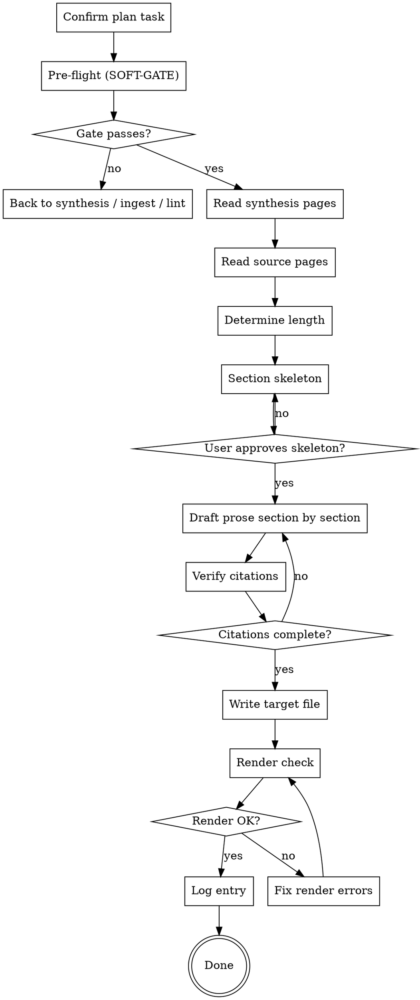

# Drafting a Manuscript

Turn stable synthesis pages into publishable prose. Every claim gets a citation. Every citation resolves in `output/bibtex/references.bib`. No inventing, no paraphrasing from memory — the wiki is the single source of truth.

**Announce at start:** "Using drafting-manuscript to draft <chapter/section> into `<path>`."

<SOFT-GATE>
Before drafting, check:
(1) At least one `knowledge/synthesis/*.qmd` with `status: stable` exists AND is referenced by the draft task
(2) Every source cited in the target section exists as `knowledge/sources/*.qmd` AND has a BibTeX entry
(3) `wiki-lint` is green on the knowledge tree
(4) The research plan `<slug>-plan.md` contains an explicit Draft task for this output file

If a condition is unmet: tell the user which (e.g. "no stable synthesis yet"),
ask for a short reason to draft anyway, write it into
`knowledge/_meta/gate-overrides.log`, and start the draft. Repeated overrides
on (3) are a maintenance signal.
</SOFT-GATE>

## When to use

- A plan Draft task is current (`executing-research-plan` routes here)
- Synthesis page(s) are stable and user asks for chapter/article draft
- Rewriting a chapter after peer-review revisions (iterate via same skill)

**NOT for:** first-draft brainstorming (use `brainstorming-research`), unsynthesized material (go back and synthesize first), grant research narratives from scratch (use `grant-finder`).

## Checklist

1. **Confirm plan task** — find the exact entry in `<slug>-plan.md`; confirm output file path
2. **Pre-flight checks (SOFT-GATE)** — stable synthesis pages? BibTeX complete? wiki-lint green?
3. **Read all referenced synthesis pages** fully
4. **Read all cited source pages** — especially the "Verbatim quotes (with page)" sections
5. **Determine target length** from the plan (words / pages / chapter size)
6. **Produce a section skeleton** — introduction, main parts, conclusion; confirm with user before prose
7. **Draft prose** — one section at a time, citations inline as `[@bibkey]` or `[@bibkey, p. 152]`
8. **Verify every citation** — each `[@bibkey]` has a matching entry in `output/bibtex/references.bib`
9. **Write to target file** — `output/publication/book/text/<nn-slug>.qmd` or `output/publication/article/main.qmd`
10. **Render check** — run `make render` (or `quarto render`) in the target `output/publication/<book|article>/` directory; fix any errors
11. **Log** — entry in `knowledge/_meta/log.qmd`: date, draft, target file, word count, source count

## Process Flow

## Citation Rules

- Inline citations: `[@finkelstein-2003]` or `[@finkelstein-2003, p. 152]`
- Multiple: `[@finkelstein-2003; @mazar-2011]`
- Every citation key MUST exist in `output/bibtex/references.bib`
- Direct quotes: inline with `>` or an em-dash, always with page number
- No uncited claims in argumentative sections (exception: common knowledge, clearly marked)
- **Web citations** (online databases, digital editions, research blogs without a BibTeX entry): use the `(domain — title)` form as an inline link, e.g. `[(idai.gazetteer.de — Tel Megiddo)](https://gazetteer.dainst.org/place/2048473)`. Use sparingly; group separately as "Web resources" in the references list.

## MCP Optimisation (recommended)

> If `dao-paper-search-mcp` and `dao-searxng-mcp` (see [`docs/recommended-mcps.md`](../../docs/recommended-mcps.md)) are available, verify citations through the MCPs instead of reconstructing them from memory. Otherwise, copy strictly from the source page's "Verbatim quotes" sections.

- **Book / article citations**: `dao-paper-search-mcp.search_crossref(doi=...)` returns `inline_citation.markdown` (a ready Author-Year link) and `authoritative_bibliography_line` (the full references-list line). Paste both verbatim instead of formatting Author-Year yourself.
- **Web citations**: `dao-searxng-mcp.fetch_url(url=...)` returns `source_class`. If `aggregator` or `suspect`, either find the primary source or name the aggregator status transparently in the text.

## Subagent Dispatch (optional, for long chapters)

For chapters > 3000 words, dispatch `drafter` subagent (see `agents/drafter.md`) per section. The subagent receives:
- The section outline
- List of synthesis pages (paths) to pull from
- List of source pages (paths) with allowed citation keys
- Target word count

Main conversation composes the final draft from section outputs.

## Quarto Template Hooks

The template's `output/publication/book/` uses a Quarto book structure (see `templates/research-project-template/output/publication/book/`):

- `_quarto.yml` defines the chapter list — update when adding a new chapter file
- `text/<nn-slug>.qmd` is the chapter-file naming convention (`01-introduction.qmd`, `02-state-of-the-field.qmd`, …)
- `template/_preamble.tex` holds LaTeX preamble for PDF output
- `Makefile` targets: `make render`, `make preview`, `make clean`

For articles, use `output/publication/article/main.qmd` with single-file layout.

## Red Flags

| Thought | Reality |
|---------|----------|
| "The source roughly says …" | Either a verbatim quote with page, or a paraphrase with a citation. No hearsay. |
| "I'll cite this passage properly later" | Later citations get forgotten. Get it right now, or not at all. |
| "I'll start drafting; structure can come later" | Skeleton first, sign-off, then prose. |
| "Wiki-lint isn't needed, I know everything is fine" | Mandatory before every draft — broken wikilinks are invisible when rendered. |
| "The chapter is so good, I'll ignore the render errors" | A chapter that won't render is not a chapter. |

## Key Principles

- **The wiki is truth** — every claim traceable to a synthesis or source page
- **Every citation verified** — bibkey existence before commit
- **Skeleton before prose** — structural sign-off first
- **Render check is part of drafting** — not "later"
- **One draft per run, one log entry** — keep changes traceable
