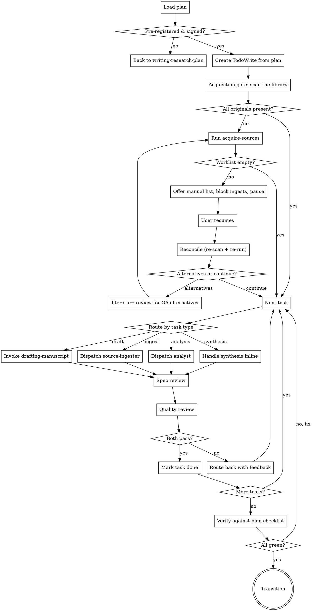

# Executing a Research Plan

Run a pre-registered plan task by task. Dispatch the right subagent per task, review each result (spec + quality), and only mark done when both reviews pass. Deviations are logged, not hidden.

**Announce at start:** "Using executing-research-plan to run `<slug>-plan.md`."

<SOFT-GATE>
Before executing a task, check:
(1) The task is listed in `input/ideas/<slug>-plan.md`
(2) For `methodology: quantitative` or any task block marked as quantitative: plan frontmatter `status: pre-registered` with user sign-off
(3) For `methodology: hermeneutic`: plan frontmatter `status: ready` is enough — a frozen hypothesis is not required

If unmet: explain to the user which condition is missing, ask for a short
reason, write it to `knowledge/_meta/gate-overrides.log`, and start the
task.

A task is "done" only when the type-specific review passes (see "Review by
methodology" below). Never silently rewrite a hypothesis mid-run —
deviations go into the deviation log.
</SOFT-GATE>

## Checklist

1. **Load the plan** — read `input/ideas/<slug>-plan.md` end-to-end
2. **Verify the plan is ready** (methodology-aware): `methodology: hermeneutic` → frontmatter `status: ready` is enough (no frozen hypothesis); `methodology: quantitative`/`mixed` (or a task block marked `pre-registered: true`) → `status: pre-registered` + user confirmation of the hypothesis
3. **Create TodoWrite items** — one per task in the plan (use the plan's own wording)
4. **Acquisition gate (before any ingest task)** — guarantee the originals are on disk first; run the **Acquisition gate** algorithm below. `literature-review` only searches — without this gate every `source-ingester` hard-stops on a missing PDF.
5. **Route each task to the right subagent:**
   - **Ingest task** → `source-ingester` (see `agents/source-ingester.md`)
   - **Analysis task** → `analyst` (runs Python/R in `output/data-analysis/`)
   - **Synthesis task** → main conversation, not subagent (high context integration)
   - **Draft task** → invoke `drafting-manuscript` skill (which may dispatch `drafter`)
6. **Two-stage review per task:**
   - **Spec reviewer** (fresh subagent): does the output match the task spec exactly?
   - **Quality reviewer** (fresh subagent): is the code/page/result methodologically sound?
   - Any "no" → route back to the executing subagent with reviewer feedback
7. **Log deviations** — if findings force change, append to `knowledge/_meta/log.md` and mark subsequent analyses as exploratory
8. **Run wiki-lint after every ingest and synthesis task**
9. **After all tasks done:** check plan's Verification section; only green on all boxes means complete
10. **Transition:** if plan output target is book/article → `drafting-manuscript`; if grant → `grant-finder`; if done → `finishing-a-research-project`

## Acquisition gate (before any ingest task)

`literature-review` searches but downloads nothing; `source-ingester` **hard-stops**
on a missing original. This gate sits between them: it guarantees every ingest
task's PDF is on disk (or explicitly deferred) before the first `source-ingester`
is dispatched — so you get one clean acquisition step instead of a wall of
per-source hard-stops.

1. **Collect required originals** — from every ingest task in the plan, derive the
   expected library path `<library>/pdf/<bibkey>.pdf` (the naming
   convention `acquire-sources` writes and `ingest-source` reads).
2. **Scan the library** — `<library>/pdf/*.pdf` (resolve with `scripts/library.py`;
   never in subfolders). If every required original is present → skip the gate,
   go to routing.
3. **Attempt acquisition** — run `acquire-sources` on the A+B set (dispatch the
   `source-acquirer` subagent for ≥ ~8 missing items). It auto-downloads the
   Open-Access copies into the library and (re)generates `input/bibliography/acquisition-todo.md`.
4. **If `acquisition-todo.md` is non-empty** (originals still missing), enter the
   **interactive resume loop** — do NOT silently skip:
   - **a. Offer the list.** Present the missing sources from `acquisition-todo.md`
     plus the manual-download instruction (university VPN / library proxy; save
     each into `<library>/pdf/` under the exact `<bibkey>.pdf`
     filename). Mark the dependent ingest TodoWrite items `blocked` and **pause** —
     do not dispatch those ingests.
   - **b. On the user's resume signal**, re-scan `<library>/pdf/` for the newly
     added PDFs and **reconcile** — re-run `acquire-sources` in reconcile mode:
     resolved rows drop out of (are checked off) `acquisition-todo.md`.
   - **c. Ask the branch:** "Search for **alternatives** (open-access substitutes
     via `literature-review`) for what's still missing, or **continue with what's
     present**?"
     - *Alternatives* → loop back to `literature-review` / `literature-scout` to
       find OA alternatives for the gaps, grade them into the guide table, then
       re-run `acquire-sources` on the new candidates → back to step 4.
     - *Continue* → proceed to routing with the acquired subset.
   - **d. Loop a–c** until the user says to move on to ingest.
5. **Proceed to routing** — dispatch `source-ingester` only for tasks whose
   original is now on disk; any still-missing stay `blocked`/deferred per the
   user's choice. Non-blocked downstream work (analysis on existing data, etc.) is
   not held up by a blocked ingest.

> **"Alternativen" = a different open-access source on the same topic**, NOT a
> preprint/prior-version/review substitute for the *same* paper. Substituting one
> edition for another remains `ingest-source`'s consent-gated decision and is out
> of scope for this gate.

## Process Flow



## Task Type Routing

| Plan keyword | Subagent / Skill | Output landing zone |
|--------------|------------------|---------------------|
| "Acquire / fetch PDFs / besorge Quellen" | `acquire-sources` skill (→ `source-acquirer` for ≥8) | `<library>/pdf/*.pdf`, `input/bibliography/acquisition-todo.md` |
| "Ingest X" | `source-ingester` | `knowledge/sources/`, `knowledge/entities/`, `output/bibtex/` |
| "Analyze / compute / run" | `analyst` | `output/data-analysis/`, `output/data-analysis/results/` |
| "Synthesize / integrate / write synthesis" | inline (main conversation) | `knowledge/synthesis/` |
| "Draft chapter / section / article" | `drafting-manuscript` skill | `output/**/*.md` |

## Critical Thinking — Cross-Cutting Checklist

Walk through this on every method choice and before every subagent dispatch:

1. **Claim first, then evidence** — what exactly is being claimed? State the claim precisely, then ask what evidence would support it.
2. **Evidence type** — primary data, secondary synthesis, expert opinion, theoretical argument. Drives the method choice.
3. **Framework matched to discipline:**
   - **GRADE** — causal / quantitative claims
   - **Cochrane ROB** — experimental designs
   - **Source-critical (*Quellenkritik*)** — textual-historical sources
   - **Stratigraphic reliability** — archaeological claims
   - **Reproducibility audit** — computational / DH
4. **Name confounders explicitly** — what gets overlooked, what could explain the finding otherwise
5. **Check logical fallacies** — ad hominem, affirming the consequent, equivocation, cherry-picking, post hoc
6. **Falsifiability** — what would refute the claim?

If the answer to any of these is "I don't know," that belongs in the quality review or gets resolved before dispatch.

## Review by Methodology

The review tiering depends on the `methodology` field in the project
frontmatter (`CLAUDE.md`) or in the task-block frontmatter.

### Quantitative Tasks — Two-Stage Review

For tasks under `methodology: quantitative` or task blocks with
`pre-registered: true`: dispatch two fresh subagents (minimal context:
just task spec + output):

**Spec reviewer prompt template:**
> You are a spec compliance reviewer. Task spec: <paste from plan>. Output: <paste or path>. Does the output match the spec exactly? Report mismatches. Do not assess quality.

**Quality reviewer prompt template:**
> You are a methodological quality reviewer. Output: <paste or path>. Methodological context: <paste plan Method section>. Is this sound? Check: (1) are assumptions stated, (2) are limitations named, (3) would a peer reviewer accept this? Report issues.

Both "yes" → task done. Any "no" → feedback back to the executing subagent.

### Hermeneutic Tasks — Synthesis Review

For tasks under `methodology: hermeneutic` (no pre-registration):
single-stage review in the main context, focused on plausibility and
source fidelity rather than spec compliance.

**Synthesis reviewer prompt template (in main context, no subagent needed):**
> Output: <path or paste>. Method sketch: <from plan>.
> (1) Is the argument actually supported by the cited sources
>     (spot-check 3 central citations)?
> (2) Are alternative readings named where they suggest themselves?
> (3) Is the hermeneutic position transparent (which pre-understanding
>     horizon, which method is applied)?

Return findings as correction notes, not as a pass/fail gate. The user
decides final acceptance.

### Mixed Projects

The plan marks per task which review mode applies. Pre-registered tasks
run through two-stage; hermeneutic tasks run through synthesis review.

## Deviations

If a task surfaces a result that contradicts the pre-registered hypothesis, or if the method must change:

1. **Stop.** Do not rewrite the hypothesis.
2. **Append to `knowledge/_meta/log.md`:**
   ```
   - YYYY-MM-DD · deviation · plan=<slug> · <what changed and why>
   ```
3. **Mark any analysis downstream of the deviation as exploratory** in its frontmatter (`status: exploratory`).
4. **Surface to user** — "The plan said X, the data shows Y. Continuing as exploratory. OK?"

## Red Flags

| Thought | Reality |
|---------|---------|
| "Just start ingesting — the PDFs are probably there" | No — run the acquisition gate first; otherwise every `source-ingester` hard-stops on a missing original, one source at a time. |
| "Some originals are still missing, I'll just skip them quietly" | No — surface the worklist, block those ingests, and let the user fetch them or pick alternatives. Silent skipping hides gaps. |
| "The hypothesis doesn't fit, I'll tweak it slightly" | No — log entry, result becomes exploratory. |
| "Review is overkill for such a small task" | Small tasks are exactly where errors slip past. Always both reviews. |
| "I'll just do it myself instead of dispatching a subagent" | Subagent isolation protects context and forces prompt clarity. |
| "The synthesis is stable now" | Only the user sets `stable`. |

## Key Principles

- **Acquire before ingest** — the acquisition gate guarantees originals are on disk (or explicitly deferred) before any `source-ingester` runs
- **The plan is law** — anything outside the plan is scope creep or deviation
- **One subagent per task** — fresh context, no context collapse
- **Two-stage review** — spec THEN quality, not mixed
- **Deviation > revision** — divergent findings get flagged, not absorbed
- **Verification is a list, not a feeling** — the plan's checkboxes are the completion test
