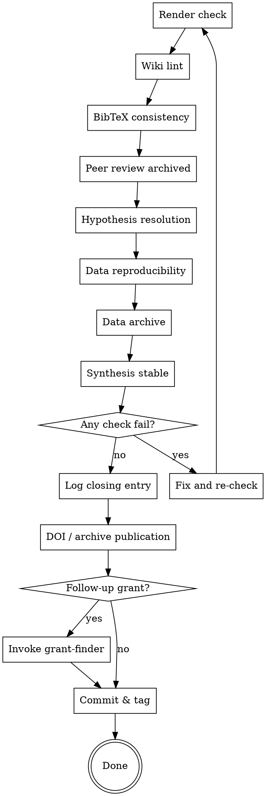

# Finishing a Research Project

The project is done only when the last checklist is green. This skill walks the final mile: rendering, archiving, DOI, submission, and optional grant follow-up.

**Announce at start:** "Using finishing-a-research-project to close out `<slug>`."

<SOFT-GATE>
Before declaring "done", check every item on the Closing Checklist below.

For unmet items: tell the user which, ask for a short reason per skipped item,
write reasons into `knowledge/_meta/gate-overrides.log`, and mark the project
in the log as either `status: done` (with documented omissions) or
`status: paused`. Hidden partial completion is not closure — explicit
justification is.
</SOFT-GATE>

## Closing Checklist

1. **Manuscript renders cleanly** — `make render` in `output/publication/<book|article>/` exits 0; PDF/HTML opens without warnings
2. **Wiki lint green** — `python scripts/lint-wiki.py` exits 0
3. **BibTeX consistent** — every citation key in the manuscript exists in `references.bib`; no unused keys (or unused are intentional)
4. **Peer review done** — both constructive and adversarial reviewer reports archived under `output/publication/<target>/reviews/`; all Major issues resolved or explicitly deferred with rationale
5. **Hypothesis addressed** — pre-registered Hypothesis is explicitly confirmed, refuted, or marked "inconclusive — exploratory" in the manuscript
6. **Data reproducibility** — `output/data-analysis/` has `requirements.txt` or `environment.yml`; a README says "run `python main.py` to reproduce"; seeds are fixed
7. **Data archive** — raw datasets in `input/data/` are licensed; derivatives in `output/data-analysis/results/` are documented
8. **Synthesis stable** — all `knowledge/synthesis/*.qmd` referenced by the manuscript have `status: stable`
9. **Log closing entry** in `knowledge/_meta/log.qmd`:
   ```
   - YYYY-MM-DD · finish · <slug> · output=<path>
   ```
10. **Publication archive (DOI)** — offer to deposit on Zenodo (or institution repository); update the log with DOI
11. **Decision: submission / follow-up** — journal / publisher / conference? grant renewal?
12. **If follow-up grant:** route to `grant-finder`
13. **If done done:** commit everything (`git add . && git commit -m "finish: <slug>"`), tag the release

## Process Flow



## Reproducibility Statement Template

Drop into the manuscript (or supplementary material):

```markdown
## Reproducibility

All analyses are reproducible from `output/data-analysis/`:

- **Code:** <files>
- **Data inputs:** `input/data/<files>` (licenses: <list>)
- **Environment:** Python <version>, see `output/data-analysis/requirements.txt`
- **Entry point:** `python output/data-analysis/main.py`
- **Random seed:** <fixed value>
- **Repository:** <git URL or Zenodo DOI>
```

## Archive / DOI

Options:

- **Zenodo** — free, accepts datasets + code + manuscripts; gives DOI immediately
- **Institutional repository** — university OA repository
- **GitHub Release + Zenodo-GitHub integration** — tag release, Zenodo creates DOI automatically

Pick one with user, update log entry with DOI.

## Submission Handoff

If submission targeted:

- Identify journal / publisher / conference CfP
- Check author guidelines — may require format conversion (invoke `file-converter` skill)
- Produce cover letter draft
- Confirm corresponding author + ORCID
- Do NOT submit on the user's behalf — prepare and hand over

## Red Flags

| Thought | Reality |
|---------|----------|
| "Wiki-lint is just a detail, I'll skip it" | Broken wikilinks are the #1 reviewer feedback point. |
| "The hypothesis was wrong, I'll just reword it" | Pre-registration principle: document honestly. The result is what it is. |
| "I'll do the Zenodo DOI later" | Later = never. Now, or explicitly into the log. |
| "Follow-up grants are separate projects" | Now is the best moment — the story is fresh in your head. |
| "It's just a working paper, not a publication" | Even unpublished work must be reproducibly archived. |

## Key Principles

- **The checklist is the closure** — not "feels done"
- **Hypothesis honesty** — what was predicted, what came out, what's open
- **Reproducibility** — manuscript AND data AND code AND environment
- **DOI before submission** — an archived version exists before the publisher process
- **Log entry is the final artefact** — the project is closed in the log
