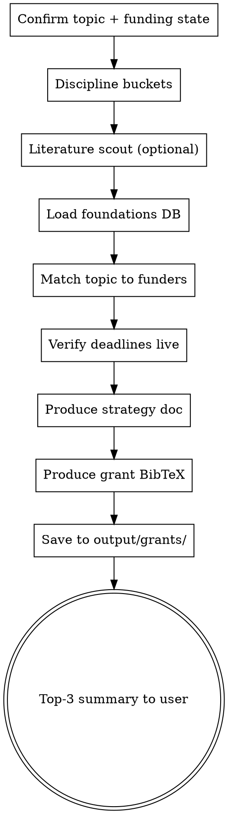

# Grant Finder (Superpowers-Wrapper)

Wrap-skill around `research-skills/dao-grant-finder`. Use when the user signals funding planning, either in parallel to a current project or to spin off a follow-up.

**Announce at start:** "Using grant-finder to map funding landscape for <topic>."

## When to use

- User asks for "funding for X", "DFG proposal", "which foundation fits", "grant for Y" (DE / EN)
- `finishing-a-research-project` → follow-up question: is there a next grant?
- Planning phase before a long-running project (to align scope with funder expectations)

**NOT for:** single-grant lookup ("when's the next DFG deadline?" → web search), writing the actual proposal (that is `drafting-manuscript` with output target = grant-proposal).

## Checklist

1. **Confirm research topic and current funding state** with user
2. **Identify discipline buckets** — Theology, Ancient Near Eastern Studies, Archaeology, Ancient History, DH — determines panel mapping
3. **Dispatch `literature-scout`** in grant-mode (optional): identify recent funded projects in adjacent topics
4. **Load curated foundation database** from `research-skills/dao-grant-finder/foundations.yaml`
5. **Match topic → funders** using the database + DFG-Fachkollegien mapping (`fachkollegien.yaml`)
6. **Verify deadlines live** — web-search current cycles for top-5 matches
7. **Produce grant-strategy document** (11 sections per dao-grant-finder template)
8. **Produce `grant-bibliography.bib`** — precedent-setting funded works and key methodological references
9. **Save outputs** to `output/grants/<YYYY-MM-DD-topic>/`
10. **Summarize top-3 recommendations** to user with live deadlines

## Process Flow



## Reference Content

`research-skills/dao-grant-finder/`:

- `SKILL.md` — full 11-section template
- `foundations.yaml` — curated funder database (DFG, ERC, VolkswagenStiftung, Gerda Henkel, Fritz Thyssen, bilateral German–Israeli programmes, etc.)
- `fachkollegien.yaml` — DFG panel mapping
- `data_sources.md` — funder API documentation
- `templates/` — DFG Forschungsstand skeleton, cover letter templates

## Output Structure

```
output/grants/<YYYY-MM-DD>-<slug>/
├── forschungsstand.md          # DFG-style 11-section document
├── funder-ranking.md           # top-10 funders with fit score + live deadlines
├── panel-recommendation.md     # DFG Fachkollegium recommendation with rationale
├── grant-bibliography.bib      # precedent funded works + methodological refs
└── README.md                   # summary + next steps
```

## Red Flags

| Thought | Reality |
|---------|----------|
| "DFG is always a fit" | The *Fachkollegium* choice is what matters, not DFG itself. |
| "I know the deadlines by heart" | Verify live — cycles change. |
| "Private foundations are second-tier" | For humanities, VolkswagenStiftung / Henkel / Thyssen are often first choice. |
| "I'll just take the top match" | Present top-3; the user picks with career context (career stage, institution). |
| "We don't need precedent works" | Reviewers expect awareness of funded prior work in the segment. |

## Key Principles

- **Panel-match before funder-match** — DFG *Fachkollegium* or ERC panel first
- **Live deadlines** — static info is unreliable
- **Top-3, not top-1** — alternatives for career context
- **Precedent bibliography** — shows familiarity with the funding landscape
- **Parallel to the running project** — the grant story is fresh when the research is fresh
