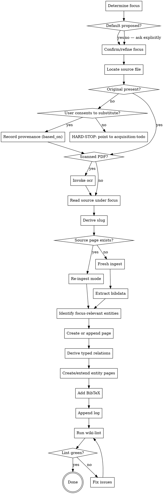

# Ingest Source (focus-driven)

Turn a raw scholarly source into structured wiki content **scoped to a specific focus** — what *this project* takes from *this source*. The wiki is purpose-built, not a generic archive. The raw PDF stays in the shared library and can be re-read later under a different focus.

One source × focus → one focus block inside `knowledge/sources/<slug>.md`. Re-ingest with a different focus → a second focus block appended to the same page. One bibkey, one wiki page, multiple lenses stacked over time.

**Announce at start:** "Using ingest-source to add `<source>` to the wiki under focus: `<focus>`."

<SOFT-GATE>
Before closing the ingest, check that all five artefacts exist and are linked:
(1) `knowledge/sources/<slug>.md` with complete frontmatter and at least one `## Focus:` block,
(2) entities referenced via wikilinks,
(3) BibTeX entry in `output/bibtex/references.bib` with matching key,
(4) entry in `knowledge/_meta/log.md`,
(5) `scripts/lint-wiki.py` exit code 0 for this source,
(6) every `## Connections` line that asserts a stance toward another page (confirms / contradicts / supplements / builds-on / cites) has a matching entry in the page's `relations:` frontmatter, each with a `confidence` value (see "Typed relations" below). Plain mentions stay as wikilinks — no `relations:` entry required for them,
(7) the BibTeX entry's `keywords` field carries 3–8 curated terms (first ingest) or has newly-recognized terms unioned in (re-ingest under a new focus) — see "BibTeX Entry Convention" below.

If any condition is missing: explain to the user which, ask for a short reason for skipping, write it to `knowledge/_meta/gate-overrides.log`, and close out the ingest.
</SOFT-GATE>

## When to use

- A new PDF/book/article has been acquired (via `acquire-sources`, or dropped in by the user) and serves a specific aspect of the project's research question
- User says "ingest this source", "ingest Finkelstein 2003 focused on the Megiddo stratigraphy", "add this to the wiki for the chronology question"
- Re-reading an already-ingested source under a new focus (a new chapter draws on a different aspect of the same source)
- Batch ingest from a literature list — loop this skill, one source per iteration, focus repeated or per-source

**NOT for:** modifying existing focus blocks (edit directly), pure BibTeX-only entries without reading (use `file-converter` or shell), or single-fact lookups.

## Checklist

Create TodoWrite tasks for each:

1. **Determine focus** — read `input/description/*.md` if present; extract the project's research question (look for `## Research question` heading or first H2). Propose: "Default focus from project description: «<research question>». Use this for the ingest or refine? (e.g. 'focus on the stratigraphic argument for Megiddo IVA' is more useful than the whole research question)." If `input/description/` is absent, ask explicitly: "What's the focus for this ingest? One sentence — what aspect of this source serves your project?" **Do not proceed without an explicit confirmed focus string.**
2. **Locate the acquired original** — the PDF lives in the **shared library**, not in the project: `<library>/pdf/<bibkey>.pdf` (placed there by `acquire-sources`; e.g. `finkelstein-2003-low-chronology.pdf`). Resolve the library with `python scripts/library.py`, or from Python: `from library import pdf_for; pdf_for("<bibkey>")`.
   **If it is missing → HARD-STOP.**
   *(Mechanised: `lint-wiki.py`'s `NO-ORIGINAL` gate reports every source page whose bibkey has no `<library>/pdf/<bibkey>.pdf`. The rule no longer depends on this paragraph being read.)*
   **When no PDF *can* exist** — a printed monograph you read from the shelf, an HTML-only publication (Internet Archaeology issues no PDF) — declare it in the source page's frontmatter instead of leaving a standing finding:
   ```yaml
   original_unavailable:
     form: physical        # or: html-only
     note: "Suhrkamp print edition; page numbers follow it. Cited chapters scanned."
   ```
   This is **not** a way to close the finding for a PDF you simply have not fetched — that belongs on `input/bibliography/acquisition-todo.md`, and neither is it `based_on` (which records that you read a *substitute*). The note must say how the cited passages stay checkable; the linter exempts the page but keeps counting the declaration, because a wiki full of them is a fact about its evidence base.
   Do NOT substitute a preprint, prior version, book review, or different edition, and do NOT auto-download a URL. Only ingest a substitute with **explicit user consent**, recorded as provenance (see "Provenance of substitutes" below).
   **Distinguish the two failures — they need different answers:**
   - *The library is not configured on this machine* (`library.py` says so): the user must point this project at it — one line in `.research-library`. Do not report this as "PDF missing"; the file may well exist.
   - *The library is configured but has no PDF for this bibkey*: the source was never acquired. Point the user at `input/bibliography/acquisition-todo.md` and offer to run `acquire-sources`.
3. **Read the source thoroughly** under the chosen focus — full text, not just abstract. Use `pdf` skill / `ocr` skill if scanned. Read with the focus question actively in mind; mark anything that bears on it.
4. **Derive `bibkey` and slug — they are NOT the same thing.**
   - **`bibkey` = the whole PDF filename stem**, `<autor>-<jahr>-<kurztitel>` (e.g. `finkelstein-2003-low-chronology`, `mazar-2011b-iron-age` when disambiguating). Never the `autor-jahr` prefix alone: `bibkey` is a **cross-project join key** (`wiki-global-graph.py` matches sources across projects on it), so it must be derivable from the work's own metadata and identical in every project that cites the work. A key without the title collides — an audit of 17 wikis found three keys each denoting *two different papers*, and 17 joins lost to keys that drifted apart.
   - **slug** = the page filename, human-readable (`finkelstein-2003.md` or `source-finkelstein-2003.md` — follow whatever the project already does). It carries no cross-project meaning; nothing joins on it.
   - `lint-wiki.py` hard-fails on an off-shape bibkey and on a `bibkey` that resolves to no `.bib` entry.
5. **Check for existing source page** — if `knowledge/sources/<slug>.md` already exists, switch to **append mode** (see "Re-ingest detection" below); otherwise proceed to create a new page.
6. **Extract bibliographic data** — authors, year, title, journal/book, pages, DOI/URL, publisher
7. **Identify entities** mentioned in passages relevant to the focus (persons, places, artefacts, concepts). Only entities relevant to the focus — others can be added later.
8. **Create or append `knowledge/sources/<slug>.md`** using the Source template (frontmatter + focus block — see below)
9. **Derive typed relations** — for every connection that asserts a *stance* toward another page (confirms / contradicts / supplements / builds-on / cites), add a structured entry to the page's `relations:` frontmatter (see "Typed relations" below). This lifts the relation semantics into the machine-readable, typed graph layer instead of leaving them as flat wikilinks. Set `confidence: extracted` only when a verbatim quote + page backs the relation, else `inferred` (`ambiguous` if the relation is unclear), and add a one-line `because` with the quote/page where possible.
10. **Create/extend entity pages** — for each NEW entity, `knowledge/entities/<entity-slug>.md`; for existing, update with wikilink back to source
11. **Add BibTeX entry** to `output/bibtex/references.bib` with key = slug. On first ingest, include a `keywords` field: 3–8 terms — the method/topic's canonical name plus known synonyms and aliases (spelling variants, other disciplines' names, stems — the same discipline `drafting-manuscript`'s "Searching for a concept, not a string" documents). This is the one field that changes on re-ingest: union any newly-recognized terms in, deduped case-insensitively (see "BibTeX Entry Convention" below). Every other field is fixed at first ingest and does not change.

    Keywords are the **recall** arm of the library search; `bib-search.py`'s rank-fused alias queries (`--q`) are the **ranking** arm. Fusion can only reorder pages that some alias literally matches — a source that describes its method in prose without ever naming it is invisible to every alias query, and the keywords you write *now, having just read the source*, are its only path into a later search result. Write them for the searcher who does not yet know this paper's vocabulary.
12. **Append line to `knowledge/_meta/log.md`** — date, slug, action (`ingest` or `re-ingest`), focus, author
13. **Run wiki-lint** — `python scripts/lint-wiki.py`. If errors, fix.
14. **Verify wikilinks resolve** — all `[[…]]` point to existing pages
15. **Post-round drift checks** — after the LAST ingest of a round, not per source. The round just created drift by design, and this is the cheapest moment to name it, while the context is loaded (the state-triggered session hook — see the `drift-report` skill — would only catch it at the NEXT session start):
    - **Pending merge:** the new bibkeys/keywords live in the project bib only; every *other* project's `bib-search` is blind to them until `merge-bibs.py` folds them into the master. Report it: "N new keyword term(s) / key(s) pending master merge — run `merge-bibs.py --report-only` when convenient." **`merge-bibs.py` is a plugin script, not a project one** — `python3 "$CLAUDE_PLUGIN_ROOT/scripts/merge-bibs.py"`; the project's `scripts/` does not contain it. Do not run the merge unasked (FACTUAL conflicts need a human verdict).
    - **Bibkey audit:** if `~/.config/research-superpowers/projects` lists ≥ 2 projects, run `python scripts/wiki-global-graph.py bibkeys <roots…>` — a new bibkey is exactly when a COLLISION or SPLIT can appear, and no single project's CI can see it.

## Re-ingest detection

When step 5 finds an existing source page:

- **Read the existing page.** Count the `## Focus:` headings already present.
- **Inform the user:** "Source `<slug>` is already ingested with N focus block(s): [list focus strings + dates]. Proceeding will append a new focus block for the current focus."
- **Same-focus warning:** if a focus block within the last 14 days matches the current focus string closely (case-insensitive substring), warn: "A recent focus block looks similar: «<existing focus>». Append anyway, update the existing block, or cancel?"
- **Legacy migration:** if the existing page predates v0.5 (no `## Focus:` headings, uses old `## Core Theses` / `## Method` / etc.), offer: "Wrap the existing content as `## Focus: (legacy — full summary) — <original updated date>` before appending the new focus block?" User chooses; if declined, just append the new focus block alongside the old structure.
- **Mode logged:** the agent output report names the mode (`fresh` | `append-section` | `update-existing-focus` | `legacy-wrap`).
- **Keywords accrete too.** Unlike the rest of the BibTeX entry, `keywords` is unioned with any newly-recognized terms from this focus pass — see step 11 and "BibTeX Entry Convention" below.

## Provenance of substitutes

The default and the norm is to ingest the **original** cited work. When the original cannot be acquired (paywalled, not yet downloaded), the honest move is to **stop and route the user to `acquisition-todo.md`** — not to quietly read a preprint, a prior version, or a book review in its place. A substitute has different pagination and sometimes different claims; ingesting it under the original's bibkey silently corrupts provenance.

Only when the user **explicitly consents** to ingest a substitute (e.g. "go ahead and ingest the preprint for now"):

1. Set `based_on:` in the source-page frontmatter — `review | preprint | prior-version` (default `original`, omitted or `original` otherwise).
2. Add a callout at the top of the focus block:
   ```markdown
   > [!warning] Provenance: based on the **preprint**, not the published original.
   > Pagination and final claims may differ. Re-ingest the original when acquired
   > (set `based_on: original`).
   ```
3. Mark the log line:
   ```
   - YYYY-MM-DD · ingest · [[slug]] · based_on: preprint (user-approved substitute) · focus: «<focus>»
   ```
4. Keep the source on `acquisition-todo.md` so the original is still acquired later; on re-ingest of the original, flip `based_on` back to `original` and remove the callout.

The `based_on` field is optional in the schema (`schema/knowledge-frontmatter.schema.json`) — `original` pages need no entry.

## Process Flow



## Source Page Template

**Frontmatter** follows the central schema at `schema/knowledge-frontmatter.schema.json` in the project root. Required fields for source pages: `title`, `type: source`, `created`, `updated`, `status`, `author`, `bibkey`. On first ingest, always `status: review` and `author: llm` — only the user moves a page to `stable`.

```yaml
---
title: "Finkelstein 2003 — Low Chronology Revisited"
type: source
created: 2026-04-15
updated: 2026-04-15
status: review
author: llm
bibkey: finkelstein-2003-low-chronology
tags: [iron-age, chronology, levant]
relations:
  - target: low-chronology
    type: supports
    confidence: extracted
    because: "Core argument of the paper (pp. 149–151)."
  - target: high-chronology
    type: contradicts
    confidence: extracted
    because: "Rejects the 10th-c. dating of Megiddo VA–IVB: «…verbatim…» (p. 156)."
  - target: mazar-2011
    type: contradicts
    confidence: inferred
    because: "Mazar later defends the Modified Conventional Chronology against this position; not stated in this source."
---
```

The `relations:` block is **optional per the schema** (`scripts/lint-wiki.py` still passes a page without it), but this skill writes it by default for every stance-bearing connection — that is what populates the *typed*, confidence-tagged graph layer at ingest time (see "Typed relations" below). Plain entity mentions need no entry: the `## Mentioned entities` wikilinks already become `wikilink` edges.

**Body sections** (focus-driven structure):

```markdown
# <Full title>

## Bibliographic Details
<Author(s)>. <Year>. *<Title>*. <Place>: <Publisher> / *<Journal>* <Volume>: <Pages>. <DOI or URL>.

## Focus: <focus string> — <YYYY-MM-DD>

### Claims relevant to this focus
1. <Claim 1 in one sentence> (p. XX)
2. <Claim 2> (pp. XX–YY)
3. <Claim 3> (p. ZZ)
*1–5 bullets max. Each one sentence. Page numbers in parentheses.*

### Direct quotes (supporting the above)
> "…" (p. XX)
*Min. 1 per focus block, max ~5. Always verbatim, always with page. Prefer
passages that carry an **explanation or an example** (why the author holds the
claim, or a concrete case), not just a restatement of the claim — these are the
raw material a later draft needs to avoid dense bullet-prose.*

### Examples & illustrations (for later drafting)
- <concrete case the source uses to support a claim — a specific artefact, site, dataset, event, or passage> (p. XX)
*0–3 bullets. Only real examples the source actually gives — the illustrative
material that makes a claim intelligible. This is what `drafting-manuscript`
reaches for when a page is otherwise too thin to develop; capturing it (or at
least its page anchor) here saves re-reading the PDF later. Omit the section if
the source offers no examples under this focus.*

### Boundary: what this source does NOT address (within this focus)
*1–3 sentences. Explicit gaps a reader following the focus should know about.*

<!-- On re-ingest with a different focus, append another `## Focus: …` block here. -->

## Other content in this source
*One paragraph (≤ 5 sentences). Brief note on major topics this source covers
that were not extracted under any current focus. Lets future readers know
what else is in there if they re-read with a different lens. This section is
REPLACED on each re-ingest, not appended — single canonical "what else is here" view.*

## Mentioned entities
- Persons: [[finkelstein]], [[mazar]]
- Places: [[tel-megiddo]], [[tel-rehov]]
- Concepts: [[low-chronology]], [[high-chronology]]
*Union of all focus passes — accretes across re-ingests.*

## Connections
- Confirms / contradicts / supplements: [[other-source]]
- Referenced in: …
*Union of all focus passes. Every stance line here (confirms / contradicts /
supplements / builds-on / cites) is mirrored by a typed entry in the
`relations:` frontmatter — the prose line is for humans, the `relations:`
entry is for the graph.*
```

**On re-ingest:** the skill appends a new `## Focus: <new focus> — <date>` block immediately after the most recent existing one (before `## Other content in this source`). It replaces `## Other content in this source` with an updated paragraph. It unions `## Mentioned entities`, `## Connections`, and the `relations:` frontmatter block — deduplicated by `(target, type)`, keeping the **higher-confidence** entry when the same pair recurs (`extracted` > `inferred` > `ambiguous`) and merging the `because` notes. It also unions the BibTeX entry's `keywords` field with any newly-recognized terms, deduped case-insensitively — the one exception to "the bibliographic header does not change" below. It does **not** touch any other bibliographic field or earlier focus blocks.

## Typed relations

The `relations:` frontmatter block is what turns a flat wikilink into a *typed,
confidence-tagged* edge in the knowledge graph. `scripts/wiki-to-graph.py` reads
it directly: a wikilink becomes a generic `wikilink` edge, but a `relations:`
entry becomes an edge carrying your `type` and `confidence` (and the `because`
shows up in the graph viz and the `relations` queries). Writing it at ingest
time means the graph is *born* typed instead of needing a later hardening pass.

**What gets an entry — and what does not.** Add a `relations:` entry for every
connection where this source takes a *stance* toward another page: it confirms,
contradicts, supplements, builds on, or cites it. Do **not** add entries for
plain "this entity appears here" mentions — those are already covered by the
`## Mentioned entities` wikilinks (which become `wikilink` edges anyway).

**Direction.** The relation runs *from this source page to the target*:
`finkelstein-2003 --contradicts--> high-chronology`.

**`target`** is the bare page slug (e.g. `high-chronology`, `mazar-2011`) and
**must resolve to an existing page** — `lint-wiki.py` flags a relation to a
missing page. If the target page does not exist yet, create it (concept/entity)
or leave the connection as prose only until it does; never point a typed
relation at a dangling target.

**`type` — recommended controlled vocabulary** (free-form is allowed, but
sticking to these keeps `relations --type …` queries useful):

| Prose in `## Connections` | `type` |
|---|---|
| confirms / agrees with / corroborates | `supports` |
| contradicts / rejects / argues against | `contradicts` |
| supplements / extends / builds on | `builds-on` |
| draws on / cites / relies on | `cites` |
| (generic association, no stance) | `mentions` |

**`confidence` — be honest, lint measures it.** `lint-wiki.py` reports the
`inferred + ambiguous` share as the wiki's inference-rate, so do not inflate to
`extracted`:

- `extracted` — explicitly supported by *this* source, ideally with a verbatim
  quote and page in `because`.
- `inferred` — a defensible link you are adding, not stated in the source
  (e.g. "Mazar later rebuts this"). The honest default when there is no quote.
- `ambiguous` — the relation is real but its type/direction is unclear.

**`because`** is one line, ideally a quote + page for `extracted` entries. It is
the natural place to ground an `inferred` relation later: when you find the
supporting passage, add the quote and flip `confidence` to `extracted`.

```yaml
relations:
  - target: high-chronology
    type: contradicts
    confidence: extracted
    because: "«The conventional dating of Megiddo VA–IVB to the 10th century cannot be sustained» (p. 156)."
```

## MCP Optimisation (recommended)

> If `dao-paper-search-mcp` (see [`docs/recommended-mcps.md`](../../docs/recommended-mcps.md)) is available in the project, add two MCP steps to the ingest. Otherwise, stick with the manual path above.

**For the BibTeX entry (step 10):** Instead of formatting by hand, fetch the ready-made reference string:

```text
dao-paper-search-mcp.search_crossref(doi=<doi>)
  → response.inline_citation.authoritative_bibliography_line
```

Take the string verbatim — it is structurally guarded against author/year hallucination. Optionally also embed `inline_citation.markdown` into the "Direct quotes" section as a clickable link.

**When creating new entity pages (step 9):** Use the resolvers for persons and places:

```text
resolve_author(name="Israel Finkelstein")
  → orcid="0000-…", wikidata_qid="Q461571", gnd_id="118533533", …

resolve_site(name="Tel Megiddo")
  → idai_gazetteer_id="2048473", coordinates=…
```

For **living researchers, prefer `orcid`** — it covers working scientists where GND / Wikidata frequently do not (a real portfolio audit found the shared method-paper authors unresolvable in either, but present on ORCID). Take it from `resolve_author`'s `orcid` field, or from orcid.org; never guess one.

Write `wikidata_qid` / `idai_gazetteer_id` / `gnd_id` into the entity page's frontmatter (schema fields optional, see `schema/knowledge-frontmatter.schema.json`). Example:

```yaml
---
title: "Tel Megiddo"
type: entity
created: 2026-04-15
updated: 2026-04-15
status: review
author: llm
wikidata_qid: Q173799
idai_gazetteer_id: "2048473"
---
```

Later research runs can deduplicate along these authority IDs and pull in canonical metadata.

**Do this by default for persons and places** — the authority ID is the join key that makes an entity matchable *across projects* (`scripts/wiki-global-graph.py overlap`); an untagged site or person is invisible to cross-project linkage. Datasets, methods, and software entities legitimately have no applicable ID — skip them. `scripts/lint-wiki.py` surfaces the coverage (`=== Authority-ID coverage ===`) and lists untagged entities as a worklist, so the gap stays visible rather than silently accumulating.

**For `type: concept` pages, the primary join key is `wikidata_qid`** — Wikidata covers concepts as well as entities, and its search API finds them (e.g. `Q483639` for cloud computing). Optionally add `getty_aat_id` (the Getty AAT controlled vocabulary, `vocab.getty.edu/aat`) where that thesaurus has a precise term — but AAT is art/architecture/heritage only, so most modern / DH / method concepts have none (measured: 2 of 19 in one project). Quote a `getty_aat_id` (`"300054327"`) so YAML keeps the all-digit value a string, not an integer. There is no resolver for concepts — look the term up and take the bare id; never guess one. Tagging shared methods/concepts (a technique two modules both use) is what makes concept-level cross-project links visible — the deepest tissue of a methods portfolio. `lint-wiki.py` reports this separately (`=== Vocabulary coverage (concepts) ===`); a project-specific concept with no external term may legitimately stay untagged.

**Back-filling untagged entities/concepts in bulk.** To close the coverage gap across a project (not just the current ingest), `scripts/suggest-authority-ids.py` (plugin-maintainer tool) lists every untagged entity/concept and prints Wikidata candidates to verify. In a rate-limited environment it **aborts** rather than tarpit — because Wikidata hard-429s some IPs. When it can't run (or the `resolve_*` MCP is absent), verify the ids directly by querying the Wikidata API through **web-fetch** (an un-throttled path): `wbsearchentities` for candidates, then `Special:EntityData/<QID>.json` to corroborate `P31`/`P106`/`P496`/`P227`. Same discipline as always — **verify each candidate against its description, reject namesakes** (a name that returns a village, a film, or an athlete is not the person), and never invent a QID. Two rules when writing the ids back: **one `wikidata_qid` must not repeat across two pages in a project** (it is a join key — a duplicate silently asserts the pages are the same referent), and resolve a page under both `<slug>.md` and `entity-`/`concept-<slug>.md` before deciding it is missing.

## BibTeX Entry Convention

Key = slug exactly. Example:

```bibtex
@article{finkelstein-2003,
  author   = {Finkelstein, Israel},
  title    = {The Low Chronology and the Problem of the Archaeology of Iron Age Palestine},
  journal  = {Tel Aviv},
  volume   = {30},
  number   = {2},
  year     = {2003},
  pages    = {149--174},
  doi      = {10.1179/tav.2003.2003.2.149},
  keywords = {low chronology; Iron Age chronology; Megiddo stratigraphy}
}
```

`keywords` is semicolon-separated (the Zotero / Better-BibTeX export convention): 3–8 terms, the canonical name plus known synonyms and aliases — this is what `bib-search.py` searches when a source describes a method in prose without ever naming it (see that script's module docstring and `drafting-manuscript`'s "Searching for a concept, not a string").

A quick self-test before moving on: run the concept search a later drafter would run —

```bash
python scripts/bib-search.py '"<canonical name>"' --q '<alias 1>' --q '<alias 2>'
```

If the alias queries alone would find this source on the pages that matter, the keywords are a bonus. If they would not — the prose-only case — the keywords you just wrote are the *only* mechanism that will surface it (`--q` fusion changes ranking, never recall), and a keyword hit prints first, ahead of every page hit. That asymmetry is why thin-but-honest keywords beat none, and why terms the paper itself never uses are exactly the ones worth recording.

If a key collides (e.g. two Finkelstein 2003 papers), append a letter: `finkelstein-2003a`, `finkelstein-2003b`. Update the source-page filename accordingly. On re-ingest with a new focus, the BibTeX entry is **not** changed — it's the same source — **except `keywords`: newly-recognized terms are unioned in, deduped case-insensitively.**

## Log Entry Convention

Append a single line to `knowledge/_meta/log.md`:

```
- YYYY-MM-DD · ingest · [[finkelstein-2003]] · focus: «<focus string>»
- YYYY-MM-DD · re-ingest · [[finkelstein-2003]] · focus: «<new focus>» (now N focus blocks)
```

## Subagent Dispatch (optional)

For batch ingest (≥ 3 sources), dispatch `source-ingester` subagent per source (see `agents/source-ingester.md`). The subagent gets fresh context with the source PDF + this skill's content + the project frontmatter schema + the focus string. Main conversation reviews the diff after each ingest.

## Red Flags

| Thought | Reality |
|---------|---------|
| "I can't get the original, I'll just ingest the book review / preprint" | No — HARD-STOP. Wrong pagination, second-hand claims, silent misattribution under the original's bibkey. Point the user to `acquisition-todo.md`; ingest a substitute only with explicit consent, recorded as `based_on:` provenance. |
| "I'll just summarise the whole source — that's safer" | No — the wiki is purpose-built, not an archive. Focus-driven extraction is the discipline. Generic summaries fill the wiki with noise that obscures what the project actually needs. |
| "The abstract gives me the claims relevant to my focus" | No — claims relevant to a focus often live in a specific section, not the abstract. Full text under the focus lens. |
| "The default focus from project-description.md is good enough" | Sometimes yes, often no — the project's research question is usually too broad to be a useful per-source focus. Refine for this specific source. |
| "I'll fill in entities later" | Then they stay unlinked. Create them now (only the focus-relevant ones; rest stays in the PDF). |
| "I'll do BibTeX at the end of the day" | The source key IS the BibTeX key — without the entry, lint fails. |
| "Skipping keywords is fine — `bib-search`'s `--q` fusion will find this source later" | No — fusion re-ranks what some alias literally matches; it adds zero recall. A source that names its method only in prose is invisible to every alias query, and the ingest moment — source just read, vocabulary fresh — is the one chance to record the terms that make it findable. |
| "Re-ingest means I should overwrite the old focus block" | No — append. The old focus is still valid (the project still needs that aspect). New focus = new block. |
| "If two focuses are similar I'll just pick one" | The skill warns at similar-focus detection but the user decides. Don't pretend two focus questions are the same when they aren't. |
| "I'll just leave the contradiction as a `[[wikilink]]`" | Then the graph sees a generic edge and loses the stance. Mirror every confirms / contradicts / builds-on / cites into a typed `relations:` entry — that is the whole point of the typed-edge layer. |
| "I'll mark every relation `extracted` so it looks solid" | No — `extracted` means a quote + page backs it. Model-added links are `inferred`. Lint reports the inference-rate; inflating it is dishonest and hides which edges still need grounding. |

## Key Principles

- **Focus-driven, not summary-driven** — the wiki documents what THIS project takes from THIS source. Generic content stays in the PDF.
- **One source = one wiki page, multiple focus blocks** — append over time as the project's needs evolve.
- **The raw PDF is the archive** — `<library>/pdf/<bibkey>.pdf` is the canonical "everything"; the wiki is the interpretation.
- **Wikilinks before full prose** — link every focus-relevant entity at first mention.
- **Typed relations at ingest** — stance-bearing connections (confirms / contradicts / builds-on / cites) go into the `relations:` frontmatter as typed, confidence-tagged edges, not just prose wikilinks. The graph is born typed; `confidence: extracted` only with a quote + page.
- **Verbatim quotations + page** — indispensable for drafts later; at least 1 quote per focus block.
- **Capture the examples, not just the claims** — the concrete cases a source uses (an artefact, site, dataset, passage) are what let a later draft develop a point instead of reflowing a bullet. Record them (or their page anchor) in `### Examples & illustrations`; a claim page with no examples produces dense prose downstream.
- **Status: review on first pass** — only moves to `stable` after user review.
- **Explicit boundaries** — name what the source does NOT address (within the focus). This honesty saves later confusion.
