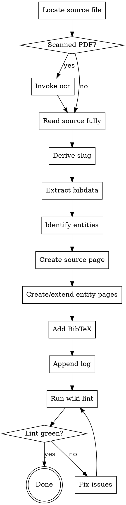

# Ingest Source

Turn a raw scholarly source into structured wiki content. One source → one `knowledge/sources/<slug>.qmd` → zero or more `knowledge/entities/*.qmd` → one BibTeX entry → one log line. Deterministic, repeatable, reviewable.

**Announce at start:** "Using ingest-source to add <source> to the wiki."

<SOFT-GATE>
Before closing out the ingest, check that all five artifacts exist and are linked:
(1) `knowledge/sources/<slug>.qmd` with complete frontmatter,
(2) entities referenced via wikilinks,
(3) BibTeX entry in `output/bibtex/references.bib` with matching key,
(4) entry in `knowledge/_meta/log.qmd`,
(5) `scripts/lint-wiki.py` exit code 0 for this source.

If any condition is missing: explain to the user which, ask for a short
reason for skipping, write it to `knowledge/_meta/gate-overrides.log`, and
close out the ingest.
</SOFT-GATE>

## When to use

- A new PDF/book/article has been identified (e.g., from `literature-review` output) and needs to enter the wiki
- User says "ingest this source", "ingest Finkelstein 2003", "add this to the wiki"
- Batch ingest from a literature list — loop this skill, one source per iteration

**NOT for:** modifying existing source pages (edit directly), pure BibTeX-only entries without reading (use `file-converter` or shell), or single-fact lookups.

## Checklist

Create TodoWrite tasks for each:

1. **Locate the source file** — PDF in `input/bibliography/`, or download if URL given
2. **Read the source thoroughly** — not skim. Use `pdf` skill / `ocr` skill if scanned. Full text, not just abstract.
3. **Derive slug** — `<lowercase-first-author>-<year>` (e.g. `finkelstein-2003`, `mazar-2011b` for disambiguation)
4. **Extract bibliographic data** — authors, year, title, journal/book, pages, DOI/URL, publisher
5. **Identify entities** — persons (historical + modern scholars), places (archaeological sites, regions), artifacts, texts, concepts mentioned
6. **Create `knowledge/sources/<slug>.qmd`** using the Source template (frontmatter below)
7. **Create/extend entity pages** — for each NEW entity, `knowledge/entities/<entity-slug>.qmd`; for existing, update with wikilink back to source
8. **Add BibTeX entry** to `output/bibtex/references.bib` with key = slug
9. **Append line to `knowledge/_meta/log.qmd`** — date, slug, action, author
10. **Run wiki-lint** — `python scripts/lint-wiki.py`. If errors, fix.
11. **Verify wikilinks resolve** — all `[[…]]` point to existing pages

## Process Flow



## Source Page Template

**Frontmatter** follows the central schema at
`schema/knowledge-frontmatter.schema.json` in the project root. For source
pages, the required fields are `title`, `type: source`, `created`, `updated`,
`status`, `author`, `bibkey`. On the first pass, always set `status: review`
and `author: llm` — only the user moves a page to `stable`.

Example frontmatter (for field names, enums, and validation see the schema):

```yaml
---
title: "Finkelstein 2003 — Low Chronology Revisited"
type: source
created: 2026-04-15
updated: 2026-04-15
status: review
author: llm
bibkey: finkelstein-2003
tags: [iron-age, chronology, levant]
---
```

**Body sections** (convention for source pages):

```markdown
# <Full title>

## Bibliographic Details
<Author(s)>. <Year>. *<Title>*. <Place>: <Publisher> / *<Journal>* <Volume>: <Pages>. <DOI or URL>.

## Core Theses
1. <Central thesis 1 in one sentence>
2. <Central thesis 2>
3. <Central thesis 3>

## Method
Which approach, which sources, which data basis.

## Relevant Findings
Findspots, excavations, data, arguments especially important for this project.
Including page numbers.

## Positioning
Place in the debate, relation to related work, critique.

## Mentioned Entities
- Persons: [[finkelstein]], [[mazar]]
- Places: [[tel-megiddo]], [[tel-rehov]]
- Artifacts / texts: [[megiddo-ivb-iva-stratum]]
- Concepts: [[low-chronology]], [[high-chronology]]

## Quotations (verbatim, with page)
> "…" (p. XX)

## Connections
- Confirms / contradicts / supplements: [[other-source]]
- References: …
- Referenced in: …
```

## MCP Optimisation (recommended)

> If `dao-paper-search-mcp` (see [`docs/recommended-mcps.md`](../../docs/recommended-mcps.md)) is available in the project, add two MCP steps to the ingest. Otherwise, stick with the manual path above.

**For the BibTeX entry (step 8):** Instead of formatting by hand, fetch the ready-made reference string:

```text
dao-paper-search-mcp.search_crossref(doi=<doi>)
  → response.inline_citation.authoritative_bibliography_line
```

Take the string verbatim — it is structurally guarded against author/year hallucination. Optionally also embed `inline_citation.markdown` into the "Quotations" section as a clickable link.

**When creating new entity pages (step 7):** Use the resolvers for persons and places:

```text
resolve_author(name="Israel Finkelstein")
  → wikidata_qid="Q461571", gnd_id="118533533", …

resolve_site(name="Tel Megiddo")
  → idai_gazetteer_id="2048473", coordinates=…
```

Write `wikidata_qid` / `idai_gazetteer_id` / `gnd_id` into the entity page's frontmatter (schema fields optional, see `schema/knowledge-frontmatter.schema.json`). Example:

```yaml
---
title: "Tel Megiddo"
type: entity
created: 2026-04-15
updated: 2026-04-15
status: review
author: llm
wikidata_qid: Q173799
idai_gazetteer_id: "2048473"
---
```

Later research runs can deduplicate along these authority IDs and pull in canonical metadata.

## BibTeX Entry Convention

Key = slug exactly. Example:

```bibtex
@article{finkelstein-2003,
  author   = {Finkelstein, Israel},
  title    = {The Low Chronology and the Problem of the Archaeology of Iron Age Palestine},
  journal  = {Tel Aviv},
  volume   = {30},
  number   = {2},
  year     = {2003},
  pages    = {149--174},
  doi      = {10.1179/tav.2003.2003.2.149}
}
```

If a key collides (e.g. two Finkelstein 2003 papers), append a letter: `finkelstein-2003a`, `finkelstein-2003b`. Update the source-page filename accordingly.

## Log Entry Convention

Append a single line to `knowledge/_meta/log.qmd`:

```
- YYYY-MM-DD · ingest · [[finkelstein-2003]] · <one-line reason / context>
```

## Subagent Dispatch (optional)

For batch ingest (≥ 3 sources), dispatch `source-ingester` subagent per source (see `agents/source-ingester.md`). The subagent gets fresh context with only the source PDF + this skill's content + the project frontmatter schema. Main conversation reviews the diff after each ingest.

## Red Flags

| Thought | Reality |
|---------|---------|
| "The abstract is enough for the core theses" | No — core theses come from the full text, otherwise you get the punchline wrong. |
| "I'll fill in entities later" | Then they stay unlinked. Create them now. |
| "I'll do BibTeX at the end of the day" | The source key IS the BibTeX key — without the entry, lint fails. |
| "Lint is just bureaucracy" | Lint catches broken wikilinks AND missing frontmatter. Required. |
| "The title is too long for the slug" | Slug follows `author-year`, not the title. |

## Key Principles

- **One ingest run = one commit** — source, entities, BibTeX, log in one coherent step
- **Wikilinks before full prose** — link every entity at first mention
- **Verbatim quotations + page** — indispensable for drafts later
- **Status: review on first pass** — only moves to `stable` after user review
- **No ingest without full reading** — abstract-only ingests poison the synthesis
