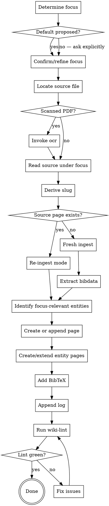

# Ingest Source (focus-driven)

Turn a raw scholarly source into structured wiki content **scoped to a specific focus** — what *this project* takes from *this source*. The wiki is purpose-built, not a generic archive. The raw PDF stays in `input/bibliography/` and can be re-read later under a different focus.

One source × focus → one focus block inside `knowledge/sources/<slug>.qmd`. Re-ingest with a different focus → a second focus block appended to the same page. One bibkey, one wiki page, multiple lenses stacked over time.

**Announce at start:** "Using ingest-source to add `<source>` to the wiki under focus: `<focus>`."

<SOFT-GATE>
Before closing the ingest, check that all five artefacts exist and are linked:
(1) `knowledge/sources/<slug>.qmd` with complete frontmatter and at least one `## Focus:` block,
(2) entities referenced via wikilinks,
(3) BibTeX entry in `output/bibtex/references.bib` with matching key,
(4) entry in `knowledge/_meta/log.qmd`,
(5) `scripts/lint-wiki.py` exit code 0 for this source.

If any condition is missing: explain to the user which, ask for a short reason for skipping, write it to `knowledge/_meta/gate-overrides.log`, and close out the ingest.
</SOFT-GATE>

## When to use

- A new PDF/book/article has been identified (e.g., from `literature-review` output) and serves a specific aspect of the project's research question
- User says "ingest this source", "ingest Finkelstein 2003 focused on the Megiddo stratigraphy", "add this to the wiki for the chronology question"
- Re-reading an already-ingested source under a new focus (a new chapter draws on a different aspect of the same source)
- Batch ingest from a literature list — loop this skill, one source per iteration, focus repeated or per-source

**NOT for:** modifying existing focus blocks (edit directly), pure BibTeX-only entries without reading (use `file-converter` or shell), or single-fact lookups.

## Checklist

Create TodoWrite tasks for each:

1. **Determine focus** — read `input/description/*.md` if present; extract the project's research question (look for `## Research question` heading or first H2). Propose: "Default focus from project description: «<research question>». Use this for the ingest or refine? (e.g. 'focus on the stratigraphic argument for Megiddo IVA' is more useful than the whole research question)." If `input/description/` is absent, ask explicitly: "What's the focus for this ingest? One sentence — what aspect of this source serves your project?" **Do not proceed without an explicit confirmed focus string.**
2. **Locate the source file** — PDF in `input/bibliography/`, or download if URL given
3. **Read the source thoroughly** under the chosen focus — full text, not just abstract. Use `pdf` skill / `ocr` skill if scanned. Read with the focus question actively in mind; mark anything that bears on it.
4. **Derive slug** — `<lowercase-first-author>-<year>` (e.g. `finkelstein-2003`, `mazar-2011b` for disambiguation)
5. **Check for existing source page** — if `knowledge/sources/<slug>.qmd` already exists, switch to **append mode** (see "Re-ingest detection" below); otherwise proceed to create a new page.
6. **Extract bibliographic data** — authors, year, title, journal/book, pages, DOI/URL, publisher
7. **Identify entities** mentioned in passages relevant to the focus (persons, places, artefacts, concepts). Only entities relevant to the focus — others can be added later.
8. **Create or append `knowledge/sources/<slug>.qmd`** using the Source template (frontmatter + focus block — see below)
9. **Create/extend entity pages** — for each NEW entity, `knowledge/entities/<entity-slug>.qmd`; for existing, update with wikilink back to source
10. **Add BibTeX entry** to `output/bibtex/references.bib` with key = slug (only on first ingest of this source; subsequent focus passes don't change BibTeX)
11. **Append line to `knowledge/_meta/log.qmd`** — date, slug, action (`ingest` or `re-ingest`), focus, author
12. **Run wiki-lint** — `python scripts/lint-wiki.py`. If errors, fix.
13. **Verify wikilinks resolve** — all `[[…]]` point to existing pages

## Re-ingest detection

When step 5 finds an existing source page:

- **Read the existing page.** Count the `## Focus:` headings already present.
- **Inform the user:** "Source `<slug>` is already ingested with N focus block(s): [list focus strings + dates]. Proceeding will append a new focus block for the current focus."
- **Same-focus warning:** if a focus block within the last 14 days matches the current focus string closely (case-insensitive substring), warn: "A recent focus block looks similar: «<existing focus>». Append anyway, update the existing block, or cancel?"
- **Legacy migration:** if the existing page predates v0.5 (no `## Focus:` headings, uses old `## Core Theses` / `## Method` / etc.), offer: "Wrap the existing content as `## Focus: (legacy — full summary) — <original updated date>` before appending the new focus block?" User chooses; if declined, just append the new focus block alongside the old structure.
- **Mode logged:** the agent output report names the mode (`fresh` | `append-section` | `update-existing-focus` | `legacy-wrap`).

## Process Flow



## Source Page Template

**Frontmatter** follows the central schema at `schema/knowledge-frontmatter.schema.json` in the project root. Required fields for source pages: `title`, `type: source`, `created`, `updated`, `status`, `author`, `bibkey`. On first ingest, always `status: review` and `author: llm` — only the user moves a page to `stable`.

```yaml
---
title: "Finkelstein 2003 — Low Chronology Revisited"
type: source
created: 2026-04-15
updated: 2026-04-15
status: review
author: llm
bibkey: finkelstein-2003
tags: [iron-age, chronology, levant]
---
```

**Body sections** (focus-driven structure):

```markdown
# <Full title>

## Bibliographic Details
<Author(s)>. <Year>. *<Title>*. <Place>: <Publisher> / *<Journal>* <Volume>: <Pages>. <DOI or URL>.

## Focus: <focus string> — <YYYY-MM-DD>

### Claims relevant to this focus
1. <Claim 1 in one sentence> (p. XX)
2. <Claim 2> (pp. XX–YY)
3. <Claim 3> (p. ZZ)
*1–5 bullets max. Each one sentence. Page numbers in parentheses.*

### Direct quotes (supporting the above)
> "…" (p. XX)
*Min. 1 per focus block, max ~5. Always verbatim, always with page.*

### Boundary: what this source does NOT address (within this focus)
*1–3 sentences. Explicit gaps a reader following the focus should know about.*

<!-- On re-ingest with a different focus, append another `## Focus: …` block here. -->

## Other content in this source
*One paragraph (≤ 5 sentences). Brief note on major topics this source covers
that were not extracted under any current focus. Lets future readers know
what else is in there if they re-read with a different lens. This section is
REPLACED on each re-ingest, not appended — single canonical "what else is here" view.*

## Mentioned entities
- Persons: [[finkelstein]], [[mazar]]
- Places: [[tel-megiddo]], [[tel-rehov]]
- Concepts: [[low-chronology]], [[high-chronology]]
*Union of all focus passes — accretes across re-ingests.*

## Connections
- Confirms / contradicts / supplements: [[other-source]]
- Referenced in: …
*Union of all focus passes.*
```

**On re-ingest:** the skill appends a new `## Focus: <new focus> — <date>` block immediately after the most recent existing one (before `## Other content in this source`). It replaces `## Other content in this source` with an updated paragraph. It unions `## Mentioned entities` and `## Connections`. It does **not** touch the bibliographic header or earlier focus blocks.

## MCP Optimisation (recommended)

> If `dao-paper-search-mcp` (see [`docs/recommended-mcps.md`](../../docs/recommended-mcps.md)) is available in the project, add two MCP steps to the ingest. Otherwise, stick with the manual path above.

**For the BibTeX entry (step 10):** Instead of formatting by hand, fetch the ready-made reference string:

```text
dao-paper-search-mcp.search_crossref(doi=<doi>)
  → response.inline_citation.authoritative_bibliography_line
```

Take the string verbatim — it is structurally guarded against author/year hallucination. Optionally also embed `inline_citation.markdown` into the "Direct quotes" section as a clickable link.

**When creating new entity pages (step 9):** Use the resolvers for persons and places:

```text
resolve_author(name="Israel Finkelstein")
  → wikidata_qid="Q461571", gnd_id="118533533", …

resolve_site(name="Tel Megiddo")
  → idai_gazetteer_id="2048473", coordinates=…
```

Write `wikidata_qid` / `idai_gazetteer_id` / `gnd_id` into the entity page's frontmatter (schema fields optional, see `schema/knowledge-frontmatter.schema.json`). Example:

```yaml
---
title: "Tel Megiddo"
type: entity
created: 2026-04-15
updated: 2026-04-15
status: review
author: llm
wikidata_qid: Q173799
idai_gazetteer_id: "2048473"
---
```

Later research runs can deduplicate along these authority IDs and pull in canonical metadata.

## BibTeX Entry Convention

Key = slug exactly. Example:

```bibtex
@article{finkelstein-2003,
  author   = {Finkelstein, Israel},
  title    = {The Low Chronology and the Problem of the Archaeology of Iron Age Palestine},
  journal  = {Tel Aviv},
  volume   = {30},
  number   = {2},
  year     = {2003},
  pages    = {149--174},
  doi      = {10.1179/tav.2003.2003.2.149}
}
```

If a key collides (e.g. two Finkelstein 2003 papers), append a letter: `finkelstein-2003a`, `finkelstein-2003b`. Update the source-page filename accordingly. On re-ingest with a new focus, the BibTeX entry is **not** changed — it's the same source.

## Log Entry Convention

Append a single line to `knowledge/_meta/log.qmd`:

```
- YYYY-MM-DD · ingest · [[finkelstein-2003]] · focus: «<focus string>»
- YYYY-MM-DD · re-ingest · [[finkelstein-2003]] · focus: «<new focus>» (now N focus blocks)
```

## Subagent Dispatch (optional)

For batch ingest (≥ 3 sources), dispatch `source-ingester` subagent per source (see `agents/source-ingester.md`). The subagent gets fresh context with the source PDF + this skill's content + the project frontmatter schema + the focus string. Main conversation reviews the diff after each ingest.

## Red Flags

| Thought | Reality |
|---------|---------|
| "I'll just summarise the whole source — that's safer" | No — the wiki is purpose-built, not an archive. Focus-driven extraction is the discipline. Generic summaries fill the wiki with noise that obscures what the project actually needs. |
| "The abstract gives me the claims relevant to my focus" | No — claims relevant to a focus often live in a specific section, not the abstract. Full text under the focus lens. |
| "The default focus from project-description.md is good enough" | Sometimes yes, often no — the project's research question is usually too broad to be a useful per-source focus. Refine for this specific source. |
| "I'll fill in entities later" | Then they stay unlinked. Create them now (only the focus-relevant ones; rest stays in the PDF). |
| "I'll do BibTeX at the end of the day" | The source key IS the BibTeX key — without the entry, lint fails. |
| "Re-ingest means I should overwrite the old focus block" | No — append. The old focus is still valid (the project still needs that aspect). New focus = new block. |
| "If two focuses are similar I'll just pick one" | The skill warns at similar-focus detection but the user decides. Don't pretend two focus questions are the same when they aren't. |

## Key Principles

- **Focus-driven, not summary-driven** — the wiki documents what THIS project takes from THIS source. Generic content stays in the PDF.
- **One source = one wiki page, multiple focus blocks** — append over time as the project's needs evolve.
- **The raw PDF is the archive** — `input/bibliography/<source>.pdf` is the canonical "everything"; the wiki is the interpretation.
- **Wikilinks before full prose** — link every focus-relevant entity at first mention.
- **Verbatim quotations + page** — indispensable for drafts later; at least 1 quote per focus block.
- **Status: review on first pass** — only moves to `stable` after user review.
- **Explicit boundaries** — name what the source does NOT address (within the focus). This honesty saves later confusion.
