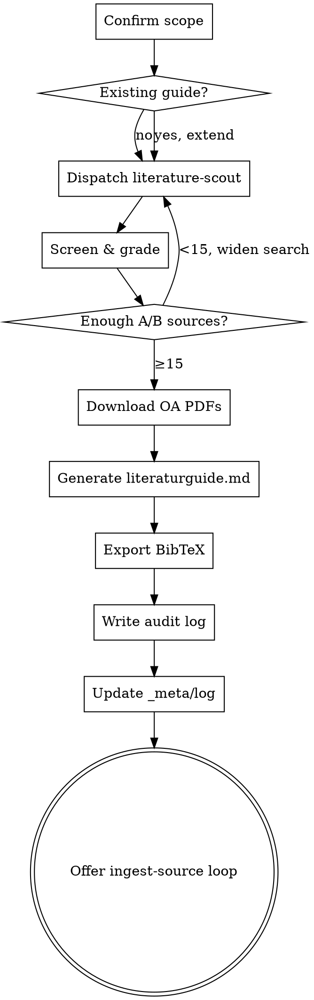

## Boundary: literature-review vs ingest-source

`literature-review` runs SEARCH — discovers candidate sources, grades them, builds a strategic guide, produces BibTeX entries. Outputs land in `input/bibliography/`. **No `knowledge/sources/*.md` is created here.**

`ingest-source` runs INTAKE — takes ONE already-located source PDF and produces the wiki content (Source page, entities, BibTeX entry, log line). It is invoked AFTER `literature-review` for each prioritized source.

The two skills are sequential, not overlapping. A typical session: literature-review once → ingest-source N times.

# Literature Review (Superpowers-Wrapper)

This skill wraps the detailed workflow of `research-skills/dao-literature-review` (OpenAlex, IxTheo, Zenon-DAI, Propylaeum, Persée, OpenEdition, CORE, arXiv, DNB) with the research-superpowers discipline: checklist, SOFT-GATE against rushing, red-flags against "I have enough sources."

**Announce at start:** "Using literature-review to build a strategic literature guide for this project."

<SOFT-GATE>
Before closing the literature phase, check:
(1) ≥ 15 distinct, discipline-appropriate sources are catalogued
(2) `literaturguide.md` (or equivalent) exists in `input/bibliography/`
(3) `output/bibtex/references.bib` is updated
(4) `knowledge/_meta/log.md` has a new entry

The threshold of 15 is a rule of thumb for a viable research base, not magic —
a tightly bounded niche topic justifies an undershoot, and a broad debate
demands more. If a condition is unmet: tell the user which, ask for a brief
reason (e.g. "narrow topic with small source corpus"), write it into
`knowledge/_meta/gate-overrides.log`, and close.
</SOFT-GATE>

## When to use

- User asks for a literature review, state of the field, *Forschungsstand*, "what has been written on X?"
- Design doc is approved and tasks in the research plan reference uningested sources
- Before drafting a *Forschungsstand* / state-of-the-field chapter — the chapter pulls from the literature guide

**NOT for:** single-paper lookups (direct metadata query), ingesting a source you already have (use `ingest-source`).

## Checklist

1. **Confirm scope with user** — field, time range, languages, geographic constraints
2. **Check for existing `literaturguide.md`** in `input/bibliography/` — if it exists, offer to extend rather than redo
3. **Dispatch `literature-scout` subagent** (see `agents/literature-scout.md`) for database queries
4. **Screen results** — titles first, then abstracts. Grade by relevance (A/B/C). Minimum 15 A/B sources before proceeding.
5. **Download OA PDFs** into `input/bibliography/<first-author>-<year>/` where legally possible
6. **Generate `literaturguide.md`** with 9 sections (research question, primary sources, debates, methods, open access, gaps, recommended reading order, follow-up searches, BibTeX overview) — template in `research-skills/dao-literature-review/examples/literaturguide-example.md`
7. **Export BibTeX** → merge into `output/bibtex/references.bib` (resolve key conflicts with user before merging)
8. **Write audit log** → `input/bibliography/audit-log-<date>.json`
9. **Update `knowledge/_meta/log.md`** with date, query, result count, guide path
10. **Transition:** offer to loop into `ingest-source` on the top-N priority items

## Process Flow

## Reference Content

The full API reference, query templates, and 9-section literaturguide.md template live in the original skill at:
`/Users/patrick/Documents/Aktuell/research-workflow/research-skills/dao-literature-review/`

Key files:
- `SKILL.md` — full workflow (English/German, all databases)
- `reference.md` — API call examples for OpenAlex, Crossref, Unpaywall, CORE, S2, arXiv, IxTheo, Zenon-DAI, etc.
- `examples/literaturguide-example.md` — canonical output format

A subagent dispatched via `agents/literature-scout.md` inherits this reference material without polluting the main conversation.

## MCP Optimisation (recommended)

> If `dao-paper-search-mcp` (see [`docs/recommended-mcps.md`](../../docs/recommended-mcps.md)) is available in the project, use the MCP tools instead of the manual API calls above — they return structurally verified citation blocks (`inline_citation.markdown`, `authoritative_bibliography_line`) and prevent Author-Year hallucinations. Otherwise stay on the manual path.

Routing by source bucket:

| Bucket | MCP tools |
|---|---|
| DAO / Levant archaeology | `search_zenon`, `search_iaa`, `search_adaj` |
| Cross-platform (academic) | `search_openalex`, `search_crossref`, `search_semantic_scholar`, `search_arxiv`, `search_core`, `search_zenodo`, `search_biorxiv` |
| Theology / ancient studies | `search_ixtheo`, `search_propylaeum`, `search_openedition`, `search_gnomon` |
| Author / place disambiguation | `resolve_author` (Wikidata + GND), `resolve_site` (iDAI.gazetteer) |

When using MCPs, paste `inline_citation.authoritative_bibliography_line` verbatim into the BibTeX export step and feed `audit.source_class` / `audit.warn_marker` into the A/B/C grading (aggregator → downgrade to C, suspect → exclude entirely).

## Red Flags (rationalisations)

| Thought | Reality |
|---------|----------|
| "15 sources are enough for now" | 15 is the MINIMUM, not the goal. |
| "English-only is faster" | German and French scholarship goes missing systematically. |
| "I already know the debate" | Knowing it doesn't replace a documented search — reproducibility. |
| "The audit log is bureaucracy" | Without it the search isn't replicable. |
| "URLs are enough, no need for PDFs" | Link rot is real. Save OA key sources locally. |

## Key Principles

- **Strategic guide, not a paper dump** — structure reading order, debates, gaps
- **German + English + French where the field demands** — discipline-specific
- **OA-first** — save PDFs where legally possible
- **Transparency** — audit log is a mandatory output
- **Keep the handoff open** — top-N sources flow into `ingest-source` next
