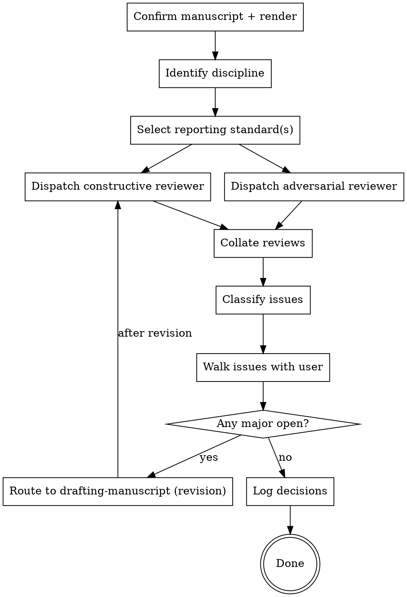

# Requesting Peer Review

Subject a drafted manuscript to structured review before submission. Two passes: **constructive** (strengthen the argument, improve clarity) and **adversarial** (find holes, challenge assumptions). Each pass is a fresh subagent with the manuscript and relevant sources — no conversation history pollution.

**Announce at start:** "Using requesting-peer-review on <manuscript path>."

<SOFT-GATE>
Before closing out the review, check:
(1) Both passes (constructive + adversarial) have produced written reports
(2) The user has decided on every Major Issue: accept / reject / defer

If unmet: explain to the user which condition is missing, ask for a short
reason, write it to `knowledge/_meta/gate-overrides.log`, and close out.
Closing a review with open Major Issues is a deliberate decision, not an
oversight — the reason in the log makes that traceable.
</SOFT-GATE>

## When to use

- A manuscript QMD file exists under `output/` and has rendered successfully
- Before sending to an external reviewer, before submission, before grant deadline
- After major revision, to re-check whether open issues were addressed

**NOT for:** first-draft feedback (use `drafting-manuscript`'s architecture and per-section stops), copy-editing (separate task), single-paragraph checks.

## Checklist

1. **Confirm target manuscript** and render status (`make render` must succeed)
2. **Identify discipline** — Theologie, Biblische Archäologie, Alte Geschichte, Digital Humanities, Mixed Methods — each has specific review criteria
3. **Select reporting standard** — CONSORT (RCT), STROBE (observational), MRC Framework (complex interventions), PRISMA (systematic review), ARRIVE (animal), TRIPOD (prediction models); **discipline-specific:** stratigraphic documentation (archaeology), Formkritik/Quellenkritik (theology), source criticism (DH)
4. **Dispatch constructive reviewer subagent** (see `agents/peer-reviewer.md`) with role `constructive`
5. **Dispatch adversarial reviewer subagent** (fresh context) with role `adversarial`
6. **Collate reviews** into a single `output/<target>/reviews/<date>-review.md` document
7. **Classify each issue:** Major / Minor / Editorial / Out-of-scope
8. **Walk the user through each Major and Minor** — decision: accept → revise, reject (with rationale), defer (with log)
9. **Log decisions** in `knowledge/_meta/log.md`, one line per pass, in this exact shape — `lint-wiki.py`'s `HALF-REVIEW` gate reads it, and an unlogged pass is an unverifiable claim that the review happened:
   ```
   ## [YYYY-MM-DD] review | constructive | <one-line verdict>
   ## [YYYY-MM-DD] review | adversarial | <one-line verdict>
   ```
   If a pass is **skipped**, log it anyway with the deciding reason (`review | adversarial | SKIPPED — <reason>, decided by <who>`). The gate then still reports the gap, which is correct: the manuscript went out on half a review, and the record should say so.
10. **If accepted issues → revisions needed:** route back to `drafting-manuscript` with issue list

## Process Flow



## Reviewer Assignment

Two subagents, FRESH context each:

**Constructive reviewer** (`agents/peer-reviewer.md`, role: constructive):
- Goal: improve the argument, clarify, strengthen
- Tone: supportive senior colleague
- Prompts: "Where is the argument weakest but most important?" "What evidence would strengthen Claim X?" "What does the reader need that isn't here?"

**Adversarial reviewer** (same skill, role: adversarial):
- Goal: find holes, challenge interpretations, flag methodological gaps
- Tone: rigorous external reviewer (Reviewer 2)
- Prompts: "Which claim is inadequately supported?" "What alternative explanation isn't addressed?" "Which sources are missing?" "Is the statistical/stratigraphic/philological method defensible?"

Both subagents receive:
- The manuscript file
- The relevant synthesis and source pages (paths listed)
- The selected reporting standard(s)
- The research plan's Hypothesis + Falsification Criteria
- A blank structured template for their report

## Review Report Template

Saved to `output/<target>/reviews/<YYYY-MM-DD>-<role>-review.md`:

```markdown
---
title: "<Role> Review — <Manuscript>"
reviewer: <subagent-id>
role: constructive | adversarial
date: YYYY-MM-DD
manuscript: <path>
reporting_standard: <CONSORT|STROBE|...|discipline-specific>
---

## Summary
<2–3 sentences: overall impression>

## Major Issues
1. **<Issue>** — <why it matters, where it lives (section/line), suggested resolution>
...

## Minor Issues
...

## Editorial
(typos, unclear phrasing, citation format)

## Methodological Assessment
<assessment against the selected reporting standard>

## Falsification Test
Quantitative/mixed: does the manuscript honestly engage with the pre-registered falsification criteria? Hermeneutic: does it state what evidence or reading would refute its thesis, and engage it? If no, flag.
```

## Critical Thinking — Evidence Audit for Reviewers

Both reviewer roles (constructive and adversarial) apply the evidence framework before any substantive assessment:

1. **Make the claim explicit** — what exactly is being claimed, in one sentence?
2. **Evidence type** — primary data, secondary synthesis, expert opinion, theoretical argument
3. **Choose the framework:**
   - **GRADE** — causal / quantitative claims
   - **Cochrane ROB** — experimental designs
   - ***Quellenkritik*** — textual-historical evidence (form, redaction, textual criticism)
   - **Stratigraphic reliability** — archaeological findings
   - **Reproducibility audit** — DH / computational
4. **Confounders** — which alternative explanations does the manuscript NOT discuss?
5. **Logical fallacies** — ad hominem, affirming the consequent, equivocation, cherry-picking, generalisation from single finds
6. **Falsification test** — would the author acknowledge what would refute the thesis, and engage it honestly?

Adversarial reviewers may apply this checklist more harshly (Reviewer 2); constructive reviewers name gaps constructively with a suggested improvement.

Grading-note template (optional appendix to the review report):

```markdown
## Evidence Grading — <Claim>

**Claim:** <exact statement from the manuscript>
**Framework:** GRADE | Cochrane ROB | Quellenkritik | Stratigraphic | Reproducibility
**Evidence type:** <primary / secondary / theoretical>
**Grade:** strong | moderate | weak | very weak
**Rationale:** Design, Bias, Precision, Consistency, Directness — short
**Confounders addressed in manuscript:** <yes/no, which>
**Logical fallacies:** <list or none>
**Falsifiability:** <testable / not testable>
```

## Discipline-Specific Checklists

Source: `research-skills/peer-review/references/` has general checklists. Add:

**Biblical Archaeology / Ancient History:**
- Stratigraphy documented with Locus/Stratum references
- Ceramic typology tied to named sequences (e.g. Iron IIA, IIB)
- 14C dates with lab numbers and calibration method
- Terminological consistency (Levantine Iron Age vs. Iron II, etc.)

**Theology / Biblical Studies:**
- Textual basis named (MT / LXX / DSS / Peshitta) with critical edition
- Formgeschichte / Redaktionsgeschichte method stated
- Engagement with German-language scholarship where relevant
- Hermeneutical stance transparent

**Digital Humanities:**
- Dataset provenance + license
- Reproducibility: code + data availability statement
- Tools and versions named
- Limitations of method explicit

## MCP Optimisation (recommended)

> If `dao-paper-search-mcp` and `dao-searxng-mcp` (see [`docs/recommended-mcps.md`](../../docs/recommended-mcps.md)) are available in the project, use them for the Cited Evidence Audit section of the review report. Otherwise, do the spot-checks manually (open the full text, compare the claim with the original passage).

Extended Cited Evidence Audit (5 spot-checks) with MCP:

| Citation | Claim | Source verifies? | source_class | Note |
|---|---|---|---|---|
| `[@bibkey, p. X]` | <claim> | yes / no / partial | primary_publisher / aggregator / ... | <reason> |

- For each cited DOI: `dao-paper-search-mcp.search_crossref(doi=...)` or equivalent adapter; compare `inline_citation.authoritative_bibliography_line` from the MCP response against the manuscript bibliography — discrepancies are Major Issues.
- For web citations (online sources): `dao-searxng-mcp.fetch_url(url=...)` and check `source_class`. Aggregator or suspect classification without an explanatory note in the manuscript is at minimum a Minor Issue.
- If no MCPs are available: drop the `source_class` column; do spot-checks by hand.

## Red Flags

| Thought | Reality |
|---------|---------|
| "One review pass is enough" | Constructive AND adversarial — both. |
| "Reviewer 2 is unfair, I'll ignore them" | Harsh critique is often the most load-bearing. Classify the entry, don't discard. |
| "I know the literature, external review is overkill" | Blind spots are by definition what you don't see. |
| "Falsification check is only for quantitative work" | Qualitative work also has to say what would refute its thesis. |
| "I'll handle Minor Issues later" | Later means never. Freeze them in the review document. |

## Key Principles

- **Two passes, fresh context each** — constructive + adversarial, kept separate
- **Discipline-specific checklist** — no universal template
- **Falsification check** — quantitative: honest engagement with the pre-registered hypothesis; hermeneutic: the manuscript says what would refute its thesis
- **Classify before revising** — Major / Minor / Editorial / Out-of-scope before editing
- **Log per decision** — accepted / rejected / deferred all documented
