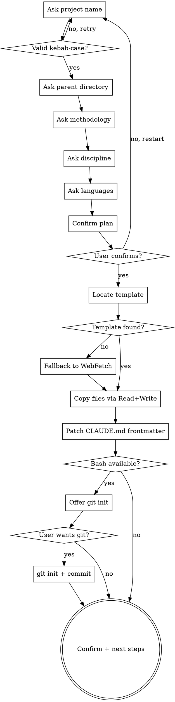

# Scaffold a Research Project

Create a new research project from the `research-project-template` without leaving the chat. Designed for users on Cowork (no terminal) and for Claude Code users who prefer a guided setup.

**Announce at start:** "Using scaffold-research-project to set up `<project_name>` at `<parent_directory>`."

## When to use

- User says "start a new research project", "scaffold a project on X", "create a new project", "set up a research project about Y"
- User on Cowork (no shell) or anyone who prefers a guided setup over `cp -r` and manual frontmatter editing
- First-time users who haven't seen the template structure yet

**NOT for:** modifying an existing project (edit `CLAUDE.md` directly), copying parts of the template in isolation (use the relevant skill — e.g. `ingest-source` will create the wiki structure on demand).

## Checklist

Create a TodoWrite task for each. Complete in order; do not write files until all inputs are collected and confirmed.

1. **Ask for project name.** Require kebab-case (lowercase, hyphens, no spaces). Reject `MyProject` or `my project` — request a slug like `iron-age-chronology` or `negev-fortresses-debate`. Validate against the regex `^[a-z][a-z0-9-]*$`.

2. **Ask for parent directory.** Offer `~/Documents` as default (expand via the Bash tool if available). If Bash is not available, ask the user to paste an absolute path. Verify the directory exists; if not, ask whether to create it.

3. **Ask for methodology.** Present the three options briefly:
   - `hermeneutic` — default. Theology, exegesis, source criticism, interpretive archaeology. No frozen hypothesis; the plan documents research question + method sketch + expected sources.
   - `quantitative` — geostatistics, 14C Bayesian, quantitative DH. Full pre-registration (hypothesis, operationalisation, stop criterion).
   - `mixed` — per-sub-study; quantitative tasks opt into pre-registration individually.
   If the user is unsure, recommend `hermeneutic` and note that they can change it later.

4. **Ask for discipline.** Free text. Offer examples: `"Biblical Archaeology"`, `"Theology / Old Testament"`, `"Ancient History"`, `"Digital Humanities"`. The string is used in the project's CLAUDE.md frontmatter.

5. **Ask for languages.** Default `[en]`. Offer `[de, en]` for German-speaking research. Other ISO 639-1 codes welcome.

6. **Confirm the plan with the user.** Present a single block:
   > "I'll create `<parent_directory>/<project_name>/` with methodology `<methodology>`, discipline `<discipline>`, languages `<languages>`. Proceed?"
   Wait for explicit confirmation. **Do not write any files before confirmation.**

7. **Locate the template.** Try, in order:
   1. Plugin cache: `~/.claude/plugins/cache/<marketplace>/research-superpowers/templates/research-project-template/`. Use Bash `ls` to confirm if Bash is available; otherwise try common marketplace names (`leiverkus-research`, `claude-plugins-community`).
   2. User-supplied path: if the user has the plugin checked out as a development clone, ask for the path.
   3. Fallback: fetch each template file from GitHub raw URLs (`https://raw.githubusercontent.com/leiverkus/research-superpowers/main/templates/research-project-template/...`) via the `WebFetch` tool. Slower but works without any local clone.

8. **Copy the template tree** file-by-file using `Read` (from the located template path) and `Write` (to the new project path). Preserve directory structure exactly. Copy these top-level entries:
   - `CLAUDE.md`
   - `README.md`
   - `.vscode/settings.json` and `.vscode/tasks.json`
   - `.gitignore`
   - `.gitlab-ci.yml`
   - `schema/knowledge-frontmatter.schema.json`
   - `scripts/lint-wiki.py`
   - `scripts/wiki-to-graph.py`
   - `scripts/graph_mcp.py` — stdlib MCP server exposing the graph queries
   - `scripts/vendor/cytoscape.min.js` (+ `scripts/vendor/README.md`) — bundled offline lib for the HTML graph viz
   - `.mcp.json` — registers the `wiki-graph` MCP server for Claude Code
   - `input/` (with its `bibliography/`, `data/`, `description/`, `ideas/`, `notes/` subdirectories — the `description/project-description.md` template file goes too)
   - `knowledge/` (plain Markdown wiki — `_meta/`, the four `_example-*.md` files in `entities/`, `concepts/`, `sources/`, `synthesis/`, plus an empty `assets/` and `_meta/log.md`, `_meta/index.md`; no `_quarto.yml` or `Makefile` — the wiki has no build step)
   - `output/` (`bibtex/references.bib`, `bibtex/csl/`, `publication/article/article.qmd`, `publication/book/_quarto.yml` and chapters, `presentation/talk.qmd`, plus their Makefiles)

9. **Patch CLAUDE.md frontmatter** with the user's answers. Read the new `CLAUDE.md`, replace the placeholder frontmatter block at the top:
   ```yaml
   ---
   methodology: <user-answer>
   discipline: "<user-answer>"
   languages: <user-answer>
   ---
   ```
   Use the Edit tool with the original placeholder block as `old_string`.

10. **Optionally init git.** If the Bash tool is available, ask: "Initialise a git repository here? (recommended; lets you track changes and roll back.)" If yes, run:
    ```bash
    cd <parent_directory>/<project_name>
    git init -b main
    git add .
    git commit -m "Scaffold research project from research-superpowers template"
    ```
    If Bash is not available or the user declines, skip — note that git can be initialised later.

11. **Confirm completion.** Tell the user:
    > "Project created at `<parent_directory>/<project_name>/`.
    > Next steps:
    > - Open `CLAUDE.md` to see the project's conventions
    > - Drop a PDF into `input/bibliography/` and say 'ingest this source' to populate the wiki
    > - For the full walkthrough, see the plugin's `docs/tutorial.md`"

## Process Flow



## Red Flags

| Thought | Reality |
|---------|----------|
| "I'll skip the methodology question and default to hermeneutic" | No — ask explicitly. Methodology drives `writing-research-plan` and `executing-research-plan` behaviour; assuming wrong wastes the user's time later. |
| "I can just `cp -r` the template" | Not in Cowork (no Bash). The Read+Write approach works everywhere. |
| "Partial copy is fine, the user can fix it" | No — failed mid-copy leaves a confusing half-state. Either complete or roll back. |
| "I'll write files before the user confirms" | No — explicit confirmation is the gate between Q&A and disk writes. |

## Key Principles

- **Ask everything first, then write** — atomic-feeling. The user types answers, sees the plan, confirms once, then files appear.
- **No bash in the core path** — only optional git init uses Bash. The scaffold itself works in any tool environment.
- **Template lookup is graceful** — plugin cache → user clone → GitHub fetch. Don't fail because the cache path varies.
- **Frontmatter is patched, not regenerated** — preserves the rest of the template's CLAUDE.md (architecture docs, workflow conventions).
- **Git is optional** — recommend it, never require it. A research project without git still works.
- **One project per invocation** — never batch.
