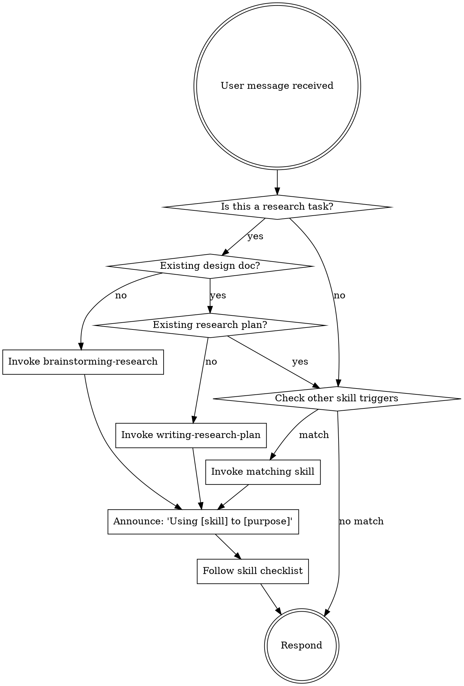

<SUBAGENT-STOP>
If you were dispatched as a subagent to execute a specific task (ingest a source, run an analysis, review a manuscript), skip this skill and follow the task prompt.
</SUBAGENT-STOP>

## When a skill should fire

When the user's request falls into a research phase — idea, plan, literature
work, source ingest, analysis, manuscript, review, wrap-up — invoke the
governing skill before you answer or edit. Skills carry the discipline that
separates a reproducible result from an unaccountable guess: checklists,
preconditions, audit trails.

When in doubt, invoke one more skill rather than one fewer. If an invoked
skill turns out not to fit, you can discard it after reading — that's cheap.
What's expensive is silent skipping.

## Instruction Priority

User instructions always take precedence:

1. **User's explicit instructions** (CLAUDE.md, AGENTS.md, direct requests) — highest priority
2. **Research-superpowers skills** — override default system behavior where they conflict
3. **Default system prompt** — lowest priority

When the user says "skip brainstorming, just draft the chapter": follow the user, but name the skipped phase explicitly. The skill mechanism for these cases is the SOFT-GATE — it logs the decision to `knowledge/_meta/gate-overrides.log` rather than blocking.

## The Research Workflow

Research projects move through phases. Each phase has a governing skill. Phases are gated — later phases cannot proceed without the artifacts the earlier phases produce.

```
brainstorming-research     → input/ideas/<slug>-design.md (SOFT-GATE: design approval)
writing-research-plan      → input/ideas/<slug>-plan.md
                              (SOFT-GATE: pre-registration only for methodology=quantitative/mixed;
                                          for hermeneutic, status=ready is enough)
literature-review          → input/bibliography/*, output/bibtex/references.bib
ingest-source (loop)       → knowledge/sources/*, knowledge/entities/*
executing-research-plan    → output/data-analysis/*, knowledge/synthesis/*
drafting-manuscript        → output/publication/**/*.qmd (SOFT-GATE: ≥1 stable synthesis + lint green)
requesting-peer-review     → review documents + revisions
finishing-a-research-project → rendered publication, archived data, grant follow-up
```

The phase graph is iterative, not linear. Legitimate back-edges:
`ingest-source` ↔ `writing-research-plan` (new reading revises the
hypothesis), `executing-research-plan` ↔ `drafting-manuscript` (an analysis
gap surfaced while writing). See `docs/phase-flow.md`.

Support skills are context-triggered, not phase-bound:

- **critical-thinking** — when evaluating evidence, methodology, or contested sources
- **grant-finder** — when planning funding in parallel to publication
- **wiki-lint** — before drafting, before finishing, after bulk ingest
- **ocr / geodata / image-processing / file-converter** — utilities invoked when data demands

## Heuristic

Invoke relevant skills before you answer or edit. A wrong invocation is
cheap (read the skill, discard, move on); a skipped skill is expensive
(missing audit trail, missed precondition).



## Red Flags (rationalisations that should trigger a skill)

| Thought | Reality |
|---------|---------|
| "It's just a quick literature question" | Questions are tasks. Check the skill. |
| "I need more context first" | Skill check comes before follow-up questions. |
| "The source is short, I'll skim it" | Ingest requires structured extraction. |
| "I have the hypothesis in my head" | Quantitative: written in the plan. Hermeneutic: research question + method sketch is enough. |
| "I'll clean up the wiki later" | Lint before draft — overrides get logged. |
| "I know what the source says" | Knowing ≠ documented. Ingest the source. |
| "Peer review is optional" | Not before publication, it isn't. |
| "I'll just freewrite the draft" | Drafts pull from synthesis pages, not from your head. |
| "This time I don't need brainstorming" | Even "simple" projects go through brainstorming — override is possible, but you owe a reason. |

## Skill Priority (multiple skills could apply)

1. **Phase skills first** (brainstorming-research, writing-research-plan, executing-research-plan) — these determine WHERE in the workflow you are
2. **Support skills second** (critical-thinking, wiki-lint) — these refine HOW you do a step
3. **Utility skills last** (ocr, geodata, image-processing, file-converter) — these handle format questions

Trigger examples:

- "Let's do research on X" → **brainstorming-research**
- "I have an idea/sketch" → **brainstorming-research**
- "Write a plan for the project" → **writing-research-plan** (if design doc exists) or **brainstorming-research** first
- "Find literature on X" → **literature-review**
- "Ingest this source" → **ingest-source**
- "Analyze the data" → **executing-research-plan** (if plan exists) else **writing-research-plan** first
- "Write the chapter" → **drafting-manuscript** (if synthesis pages stable) else back to synthesis
- "Review the manuscript" → **requesting-peer-review**
- "Find funding" → **grant-finder**

## Skill Types

**Rigid** (must follow the checklist exactly, do not skip steps):
- brainstorming-research, writing-research-plan, ingest-source, executing-research-plan, drafting-manuscript, finishing-a-research-project

**Flexible** (adapt principles to context):
- critical-thinking, literature-review, peer-review, grant-finder, wiki-lint

The skill itself tells you which.

## How to Access Skills

**In Claude Code:** Use the `Skill` tool. The skill content is presented to you — follow it. Never `Read` a skill file in place of invoking it.

**In OpenCode:** Skills load natively from `skills/<name>/SKILL.md` and `.claude/skills/<name>/SKILL.md`. Trigger them via natural language or the built-in `skill` tool (e.g. `skill({ name: "ingest-source" })`).

## The Research Project Template

Every research project uses the same folder layout (from `templates/research-project-template/`):

```
project-root/
├── input/       # human-authored: bibliography, data, notes, ideas (design & plan docs live here)
├── knowledge/   # LLM-generated wiki: entities, concepts, sources, synthesis
├── output/      # publishable artifacts: publication (Quarto), data-analysis, bibtex
└── scripts/     # lint-wiki.py and project helpers
```

If the working directory is not yet a research project, the first skill invocation should offer to scaffold it from the template.
