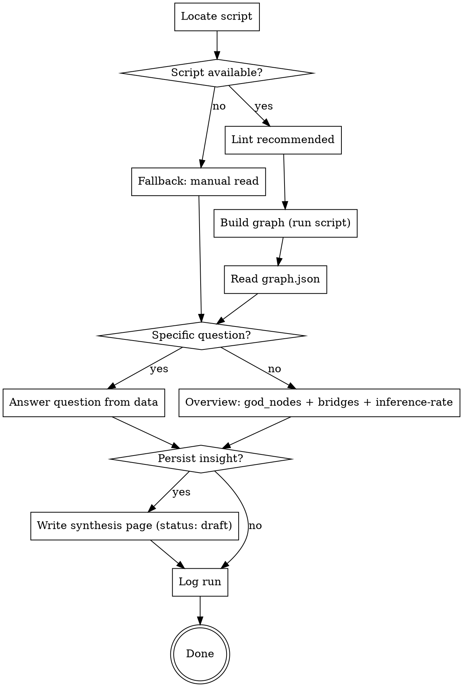

# Wiki Graph

Make the implicit wiki graph explicit, then answer structure questions from it. This is the **structure-analysis** sibling of two other wiki skills:

- `wiki-lint` — *is the wiki well-formed?* (frontmatter, broken links, orphans)
- `semantic-wiki-review` — *are the claims sound and consistent?* (LLM content audit)
- **`wiki-graph` — *what shape does the knowledge have?*** (hubs, bridges, clusters, confidence)

The graph is computed deterministically by `scripts/wiki-to-graph.py`; this skill runs it and **interprets** the result. It never invents edges — every claim about the graph traces back to `graph.json`.

**Announce at start:** "Using wiki-graph to build and analyse the knowledge graph."

## When to use

- "Build / show me a knowledge graph", "map the wiki", "graph view of my research"
- "Which entity bridges / connects my sources?" → bridges
- "What are the most central / connected pages?" → god nodes
- "Find surprising connections" / "where are the weak links or gaps?"
- "How many relations are inferred vs grounded?" → inference-rate
- "Export the wiki to Gephi / yEd" → hand over `graph.graphml`
- After a bulk ingest or a `wiki-lint` pass, to see how the structure changed

**NOT for:** frontmatter/wikilink validation (use `wiki-lint`), contradiction/claim audit (use `semantic-wiki-review`), or drafting prose (use `drafting-manuscript`).

## Checklist

1. **Locate the script** — `scripts/wiki-to-graph.py` in the project root (from the template). If it is missing, offer to copy it from the template (or scaffold the project); if Python/PyYAML are unavailable, take the **fallback** below.
2. **Lint first (recommended)** — broken wikilinks become dangling edges and skew the picture. If `wiki-lint` has not run recently, suggest it; note any override.
3. **Build the graph** — `python scripts/wiki-to-graph.py` (add `--top-n N` if the user wants more/fewer god nodes). It writes `graph.html` (interactive, self-contained), `graph.json`, and `graph.graphml` into `knowledge/_meta/graph/`.
4. **Read `graph.json`** — never answer from memory of the wiki; read the actual export.
5. **Answer the question grounded in the data** (see "Reading the output"). If no specific question was asked, give the overview: god nodes, bridges, inference-rate, and any dangling/orphan signal.
6. **Be honest about confidence and gaps** (see "Honesty rules"). If the user asks about a connection that is not in the graph, say so — and offer to add a `relations` entry or a wikilink rather than asserting it.
7. **Offer the viz** — for an interactive look, point the user to `knowledge/_meta/graph/graph.html` (opens in any browser, no install; filter/search/click). For heavy layout or community detection, `graph.graphml` opens in Gephi/yEd.
8. **Persist an insight (optional, with consent)** — if the analysis yields a standalone finding the user wants to keep, write a `knowledge/synthesis/<slug>.md` page with `status: draft`, `author: llm`. Never self-promote to `review`/`stable`.
9. **Log** the run in `knowledge/_meta/log.md`: date, `graph`, question (or "overview"), node/edge counts, headline finding.

## Process Flow

## Reading the output

`graph.json` has `stats`, `nodes`, `edges`, `god_nodes`, `bridges`.

- **god_nodes** — pages ranked by total degree (incident edges). The most-connected pages. High degree signals a hub, **not automatically importance** — a generic entity can rack up links. Read it as "where the wiki converges", then judge.
- **bridges** — entities that join ≥2 source clusters which share no *other* entity. These are the load-bearing connectors: remove one and parts of the literature fall apart. Often the most analytically interesting nodes.
- **edges** — each has `relation_type` (`wikilink` for plain links; `cites` / `contradicts` / `builds-on` / … for typed `relations`), `confidence`, and `weight` (how many times a wikilink recurs). Filter by `relation_type` to answer e.g. "show me the contradictions".
- **stats.relations_total / relations_inferred_or_ambiguous** — the inference-rate. A high share means many edges are model-asserted rather than grounded in the sources; surface this honestly (it mirrors the SOFT-GATE override-rate as an audit signal).
- **stats.dangling** — edges pointing to non-existent pages were dropped. A non-zero count means the wiki references things it hasn't ingested → route to `wiki-lint` / `ingest-source`.

## Honesty rules

- **No invented edges.** Only report connections present in `graph.json`. If asked about a link that isn't there, say it isn't — don't infer it into existence in your answer.
- **Flag inferred/ambiguous edges** when they carry an argument. Don't present an `inferred` relation as if it were `extracted`.
- **Degree ≠ importance.** Name what high degree actually means (hub of links) and let the user judge significance.
- **Don't write to `input/`.** Insights go to `knowledge/synthesis/` (with consent), never into the immutable input layer.
- **Don't self-promote.** Any synthesis page you create is `status: draft`; only the user promotes.

## Python-free fallback

If `python3` / `pyyaml` / the script are unavailable (e.g. Cowork without a shell):

- Do a **best-effort manual read**: list the wiki pages, and for a small wiki count incoming wikilinks per page to approximate god nodes.
- **State the limitation clearly:** bridges and the inference-rate are impractical to compute by hand and are **not** reported in fallback mode.
- Recommend installing Python + PyYAML (or running the script elsewhere) for the full analysis, and hand over `graph.graphml` once it can be generated.

Never fake precise counts in fallback mode — approximate, and say so.
