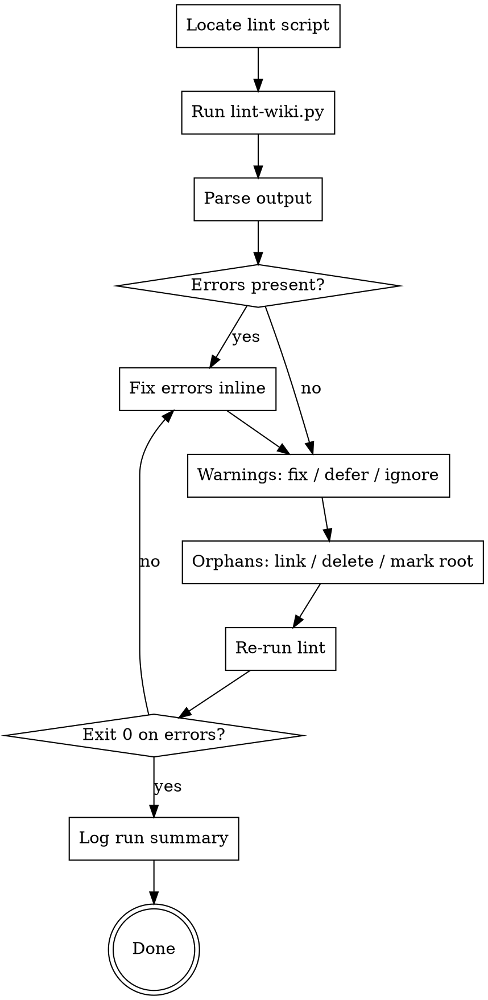

# Wiki Lint

Run the wiki linter and act on its findings. Mandatory gate before `drafting-manuscript` and `finishing-a-research-project`; useful after bulk ingest or whenever the wiki has grown.

**Announce at start:** "Using wiki-lint to validate the knowledge tree."

<SOFT-GATE>
Before transitioning to `drafting-manuscript` or `finishing-a-research-project`:
(1) `scripts/lint-wiki.py` exits 0

If not met: tell the user which classes of issues remain (errors / warnings /
orphans), ask for a short reason to proceed anyway (e.g. "orphan is intentional
— it's the index page"), and write the reason into
`knowledge/_meta/gate-overrides.log`. Errors should as a rule be fixed rather
than overridden — the override is an audit trail, not a substitute.
</SOFT-GATE>

## When to use

- Before `drafting-manuscript` (soft gate)
- Before `finishing-a-research-project` (soft gate)
- After `ingest-source` batch runs (≥ 3 new sources)
- When user says "clean up the wiki", "lint", "check the wiki"
- Periodically when the project is long-running

## Checklist

1. **Locate the lint script** — `scripts/lint-wiki.py` in the project root (from template)
2. **Run it** — `python scripts/lint-wiki.py`
3. **Parse output** into categories: errors, warnings, orphans
4. **Fix errors inline** (missing frontmatter fields, broken wikilinks, invalid `type` values)
5. **Assess warnings** — stale pages, status inconsistency, empty sections — decide with user: fix / defer / ignore
6. **Handle orphans** — pages with no incoming wikilinks: decide link-in, delete, or mark as root
7. **Re-run lint** until exit 0 on errors
8. **Log** the run in `knowledge/_meta/log.qmd` with summary (N errors fixed, N warnings deferred)
9. **Dispatch `wiki-linter` subagent** (optional) for large wikis — see `agents/wiki-linter.md`

## Process Flow

## What lint-wiki.py Checks

(per the template's `scripts/lint-wiki.py`)

- Frontmatter present + required fields (`title`, `type`, `created`, `updated`, `status`, `author`)
- `type` ∈ {entity, concept, source, synthesis}
- `status` ∈ {draft, review, stable}
- `author` ∈ {human, llm, mixed}
- Dates are ISO (`YYYY-MM-DD`)
- Wikilinks `[[...]]` resolve to existing files
- No duplicate page titles within a section
- Orphan detection (pages with zero incoming wikilinks)

## Common Fixes

| Error | Fix |
|-------|-----|
| `missing frontmatter field: status` | Add `status: draft` (or proper value) |
| `broken wikilink: [[finkelstein-2003]]` | Either create `knowledge/sources/finkelstein-2003.qmd` via `ingest-source`, or correct the slug |
| `invalid type: Person` | Change to `entity` (types are: entity, concept, source, synthesis) |
| `created is not ISO date` | Reformat to `YYYY-MM-DD` |
| `orphan: knowledge/entities/foo.qmd` | Add an incoming link from a relevant source/synthesis page |

## Red Flags

| Thought | Reality |
|---------|----------|
| "Lint is bureaucracy, skip it" | SOFT-GATE before drafting and finishing. The override gets logged. |
| "I'd notice broken wikilinks while reading" | No — when rendered they vanish silently. They're only visible to the linter. |
| "Orphans are fine, just internal notes" | Orphan means unreachable. Link them in or delete them. |
| "I can ignore all warnings" | Every warning needs a decision, not silence. |

## Key Principles

- **Fail loud, fix fast** — errors block, warnings demand a decision
- **One lint run = one log entry** — traceability
- **Orphans are a smell** — often a sign of missing synthesis
- **Lint BEFORE draft** — never after the fact
- **Subagent for bulk fixes** — don't burn the main context on large wikis
