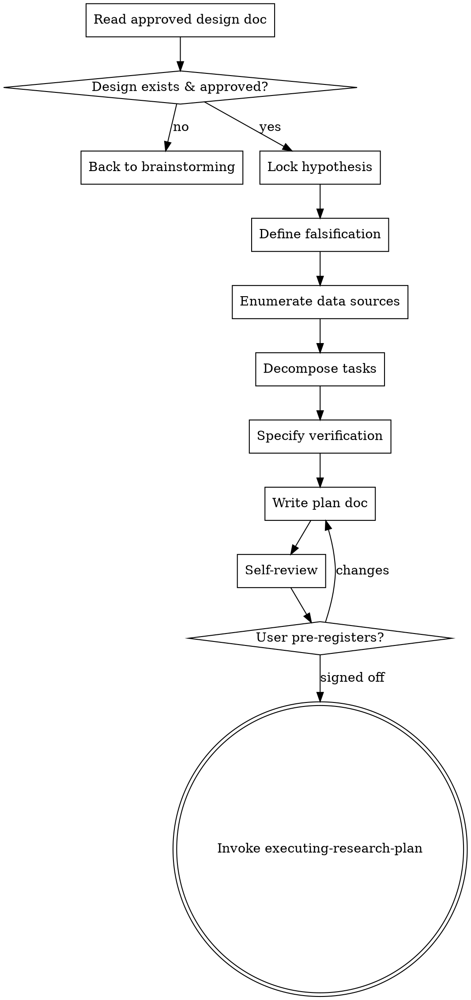

# Writing a Research Plan

Take an approved design doc (`input/ideas/<slug>-design.md`) and turn it into an executable research plan (`input/ideas/<slug>-plan.md`). The plan is the contract between idea and execution: it pre-registers the hypothesis, locks the method, lists bite-sized tasks, and defines verification criteria.

**Announce at start:** "Using writing-research-plan to convert the design into a pre-registered plan."

<SOFT-GATE>
Before transitioning to `executing-research-plan`, `ingest-source` (outside
the plan's task list), `drafting-manuscript`, or any analysis skill, check:
(1) The plan exists at `input/ideas/<slug>-plan.md`
(2) For `methodology: quantitative` (or any task block marked as
    quantitative): the user has explicitly confirmed the **Hypothesis** and
    **Falsification Criteria** (plan frontmatter `status: pre-registered`)
(3) For `methodology: hermeneutic`: plan frontmatter `status: ready` is
    enough — the plan contains the research question, method sketch, and
    expected sources, but no frozen hypothesis

If unmet: explain to the user which condition is missing, ask for a short
reason, write it to `knowledge/_meta/gate-overrides.log`, and continue.
</SOFT-GATE>

## Methodology and Pre-Registration

The project frontmatter (see `CLAUDE.md`) declares a `methodology`. This
skill behaves differently depending on the value:

- **hermeneutic** (default for theology / exegesis / *Quellenkritik* /
  interpretive archaeology): pre-registration is **not** enforced. Instead
  the plan requires a precise research question, a method sketch (which
  hermeneutic procedures, on which material), and a list of expected
  sources. Hypothesis revision through new reading is legitimate and gets
  recorded in `knowledge/_meta/log.md` — the *hermeneutic circle* is
  constitutive, not a methodological failure.

- **quantitative** (for geostatistics, 14C Bayesian work, quantitative DH
  methods): full pre-registration. **Hypothesis** and **Falsification
  Criteria** are frozen from sign-off onward. Deviations are documented; the
  result is explicitly marked as exploratory rather than turned into a
  confirmation by silent plan edits.

- **mixed**: pre-registration per sub-study. Quantitative tasks get a
  `pre-registered: true` block; hermeneutic tasks don't. The plan marks
  this per task in the task block's frontmatter.

The plan templates below show both variants.

## Checklist

1. **Read the design doc** — `input/ideas/<slug>-design.md`. If it does not exist or is not approved, stop and invoke `brainstorming-research`.
2. **Lock the hypothesis** — one sentence, falsifiable or argumentatively prüfbar, in the user's own words after confirmation
3. **Define falsification criteria** — what observation would make you reject the hypothesis
4. **Enumerate data sources** — exact sources, with status (pending ingest / already in wiki)
5. **Decompose into tasks** — Ingest tasks, Analysis tasks, Synthesis tasks, Draft tasks; each step 2–15 min
6. **Specify verification criteria** — how we know the project is done (lint green, N sources ingested, chapter renders, …)
7. **Write plan doc** to `input/ideas/<slug>-plan.md` using the template below
8. **Self-review** — no placeholders, type consistency across tasks, spec coverage from design doc
9. **User reviews and signs off on hypothesis + task list** — this is the pre-registration moment
10. **Hand off to executing-research-plan**

## Process Flow



## Plan Document Template

Save to `input/ideas/<slug>-plan.md`. The frontmatter `status:` value depends
on the methodology: `pre-registered` (quantitative or mixed with pre-registered
parts) vs. `ready` (hermeneutic).

### Quantitative / Mixed (with pre-registration)

```markdown
---
title: "<Plan title — same slug as the design>"
type: plan
created: YYYY-MM-DD
updated: YYYY-MM-DD
status: pre-registered
author: mixed
design: "[[<slug>-design]]"
---

# <Title> — Research Plan

> **For agentic workers:** REQUIRED SUB-SKILL: Use `research-superpowers:executing-research-plan` to run this plan task by task. Tasks use checkbox (`- [ ]`) syntax for TodoWrite integration.

**Research Question:** <precise guiding question>
**Hypothesis (pre-registered, immutable):** <one sentence>
**Falsification Criteria:** <what would falsify H>
**Stop Criterion:** <when is data collection done — sample size, time window, data availability>
**Method:** <2–3 sentences on the procedure>
**Output target:** book-chapter | article | grant-proposal | conference-talk
**Language:** de | en | mixed

---
```

### Hermeneutic (no pre-registration)

```markdown
---
title: "<Plan title — same slug as the design>"
type: plan
created: YYYY-MM-DD
updated: YYYY-MM-DD
status: ready
author: mixed
design: "[[<slug>-design]]"
---

# <Title> — Research Plan

> **For agentic workers:** REQUIRED SUB-SKILL: Use `research-superpowers:executing-research-plan` to run this plan task by task.

**Research Question:** <precise guiding question>
**Method sketch:** <which hermeneutic / source-critical / interpretive procedures, on which material>
**Expected source corpus:** <primary sources, secondary literature in keywords — may broaden through reading>
**Iteration expectation:** <which phases the plan will iterate — e.g. "repeated switching between ingest and synthesis until the source picture stabilises">
**Output target:** book-chapter | article | grant-proposal | conference-talk
**Language:** de | en | mixed

---
```

In both variants, Data Sources, Tasks, and Verification follow as shown
below. For **mixed**, quantitative tasks mark `pre-registered: true` in the
block frontmatter.


## Data Sources

- [[finkelstein-2003]] — *ingest pending*
- [[mazar-2011]] — *already in knowledge/sources/*
- Dataset: `input/data/megiddo-stratigraphy.csv`
- Archive: Israel Antiquities Authority, IAA-Nr. XXX (access: on-site visit required)

## Tasks

### Task 1: Ingest foundational sources
**Files:** `knowledge/sources/*.md`, `output/bibtex/references.bib`

- [ ] Ingest Finkelstein 2003 via `ingest-source` skill → `knowledge/sources/finkelstein-2003.md`
- [ ] Ingest Mazar 2011 via `ingest-source` skill → `knowledge/sources/mazar-2011.md`
- [ ] Verify BibTeX keys match citation style (chicago-author-date.csl)

### Task 2: Analyze stratigraphic sequence
**Files:** `output/data-analysis/stratigraphy.py`, `output/data-analysis/results/phases.json`

- [ ] Create `stratigraphy.py` — loads `input/data/megiddo-stratigraphy.csv`
- [ ] Compute Bayesian phase overlaps via PyMC
- [ ] Save posterior to `results/phases.json`
- [ ] Write assumption-check note in `knowledge/synthesis/stratigraphy-assumptions.md`

### Task 3: Synthesize into a stable knowledge page
**Files:** `knowledge/synthesis/chronologie-debatte.md`

- [ ] Pull entities [[tel-megiddo]], [[tel-rehov]], [[finkelstein]], [[mazar]]
- [ ] Argument structure: Position A, Position B, own reading, evidence weight
- [ ] Cite ≥ 10 sources from BibTeX
- [ ] Set `status: stable` once reviewed by user

### Task 4: Draft chapter "*Forschungsstand* — Chronology"
**Files:** `output/publication/book/text/03-forschungsstand.md`

- [ ] Confirm `wiki-lint` is green
- [ ] Draft 2500–3500 words via `drafting-manuscript` skill
- [ ] Citations `[@bibkey]` from `output/bibtex/references.bib`

## Verification

The project is complete when:
- [ ] `scripts/lint-wiki.py` exits 0
- [ ] ≥ 15 sources ingested, all with `status: stable` or `review`
- [ ] `knowledge/synthesis/chronologie-debatte.md` has `status: stable`
- [ ] `make render` in `output/publication/book/` produces PDF without errors
- [ ] Peer review round completed via `requesting-peer-review`
- [ ] Hypothesis explicitly confirmed, refuted, or marked "inconclusive — exploratory"

## Deviations Log

Append to `knowledge/_meta/log.md` whenever scope, method, or data sources change after pre-registration. Reference the plan slug.
```

## No Placeholders (plan failures — never write these)

- "TBD", "see later", "add relevant literature"
- "more tasks as needed" (make concrete or delete)
- Tasks without file path ("an analysis somewhere")
- Citations without BibTeX key ("probably Finkelstein")
- Verification criteria without measurability ("the chapter feels good")

## Self-Review Checklist (inline)

1. **Spec coverage:** every point from `input/ideas/<slug>-design.md` — is it covered by a task?
2. **Placeholder scan:** remove the red flags (see above)
3. **Type consistency:** if task 2 writes `phases.json`, does task 3 reference exactly that file?
4. **Falsifiability:** is the hypothesis actually testable, or just a thesis?
5. **Granularity:** are all steps 2–15 min? Split longer ones
6. **No gaps between Ingest → Analysis → Synthesis → Draft**

Fix errors inline.

## Sign-off

After self-review:

- For **quantitative** or **mixed with pre-registered tasks**:
  > "Plan written and saved at `<path>`. Please explicitly confirm the
  > **Hypothesis** and the **Falsification Criteria** — once confirmed they
  > are frozen (pre-registered). Deviations later go into log.md. OK?"
  >
  > Only after explicit confirmation set `status: pre-registered` and
  > invoke `executing-research-plan`.

- For **hermeneutic**:
  > "Plan written and saved at `<path>`. Research question, method sketch,
  > and expected sources are recorded. Hypothesis remains open — revision
  > through reading is logged in `_meta/log.md`. Does the plan look right?
  > Then I'll set `status: ready`."
  >
  > After confirmation set `status: ready` and invoke
  > `executing-research-plan`.

## Key Principles

- **Hypothesis before data** — pre-registered
- **Bite-sized tasks** — 2–15 min, exact file path
- **Verification measurable** — not "good enough"
- **Deviation log** — document deviations, don't hide them
- **YAGNI** — only tasks that follow from the design
