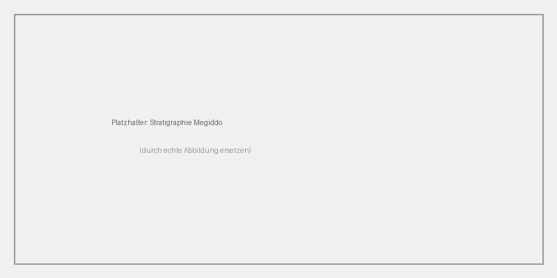

# Tel Megiddo {#sec-entity-tel-megiddo}

Tel Megiddo (Hebrew תל מגידו, Arabic Tell el-Mutesellim) is an
archaeological settlement mound in northern Israel, on the southern
edge of the Jezreel Valley.

## Relevance to the research question

> [Describe here why this site matters for the project. Tie it back to
> the research question in `input/description/`.]

## Description

The tell covers about 6 hectares and shows over 20 occupation layers,
spanning from the Chalcolithic to the Persian period. The site has
been a UNESCO World Heritage Site since 2005.

The stratigraphic sequence (see figure above) is central to the
chronology debate.

## Relationships

- Located in the [[concept-jesreel-ebene]]
- Central site in the [[concept-low-chronology]] debate
- Excavated by the Megiddo Expedition Team

## Coordinates

| Source    | Lat       | Lon       | Deviation  |
|-----------|-----------|-----------|------------|
| GeoNames  | 32.5847   | 35.1749   | —          |
| Pleiades  | 32.5850   | 35.1750   | ~30 m      |

Accuracy: `verified` (two agreeing sources).

## Sources

- @finkelstein-2003-low-chronology — stratigraphy and chronology
